```
Date: 2024.10.12
Author: Taylor Troesh
Source: https://taylor.town/history-of-microwave-ovens
```

# A History of Microwave Ovens

*Special thanks to Cory at [Radarange.com](https://www.radarange.com/) for preserving so much valuable history!*

*Feel free to skip the science nonsense (especially in the beginning) and skim through the pictures.*

People started seriously thinking about heating things with [radio](https://en.wikipedia.org/wiki/Radio_frequency) waves [circa 1940](https://taylor.town/microwaves.pdf).

*This happens to be the same period when people started thinking about [blowing things up with atomic nuclei](https://en.wikipedia.org/wiki/History_of_nuclear_weapons).*

Some molecules (notably water) are tiny magnets. Waves and magnets interact in [spooky ways](https://en.wikipedia.org/wiki/Electromagnetism). Certain radio wave frequencies cause molecules to spin; spin is angular velocity is kinetic energy is heat. Many smart people call this ["dielectric heating"](https://en.wikipedia.org/wiki/Dielectric_heating).

Lots of cool radar technology (e.g. the [cavity magnetron](https://en.wikipedia.org/wiki/Cavity_magnetron)) was developed for WWII. After the war, some military technology was reimagined for commercial/domestic use.

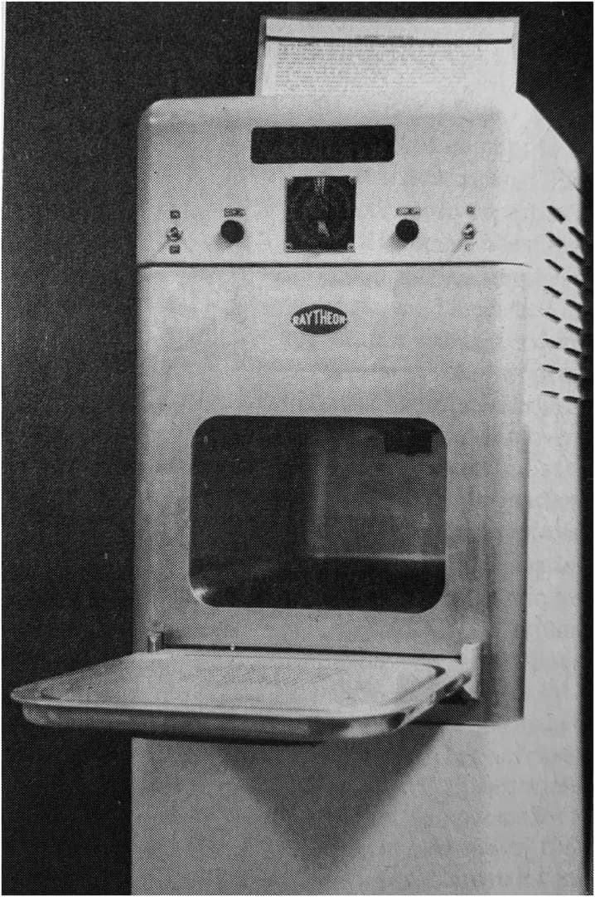

**1947:** The Radarange 1132 was the first commercially available microwave oven. That behemoth provided 1600W output [via a water-cooled permanent-magnet magnetron](https://taylor.town/microwaves.pdf) -- obviously not a domestic machine.

But Raytheon's basic idea was simple: put food in a [Faraday cage](https://en.wikipedia.org/wiki/Faraday_cage) and blast it with 2.4 GHz radio waves to spin the water molecules.

*Yes, 2.4 GHz is conspicuously the same frequency as Wi-Fi and Bluetooth…*

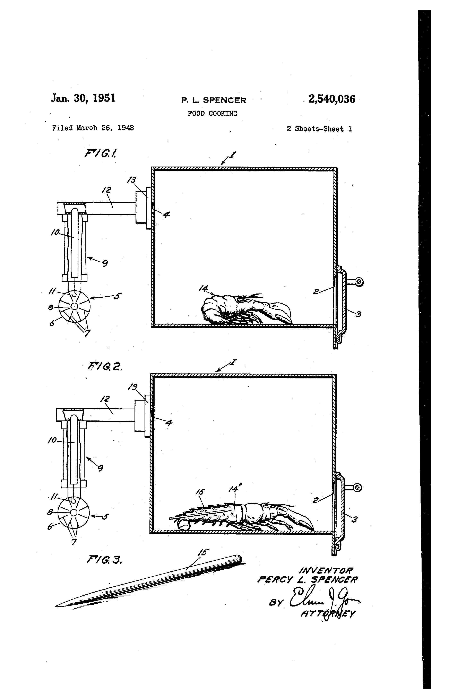

At the time, it wasn't clear if dielectric heating was a good fit for food. Wetter foods cook at higher intensities, which is surprisingly unintuitive. Even worse, regions of non-homogeneous foods (i.e. mostly everything) cook unevenly, which is generally undesired behavior in culinary arts.

*One early Raytheon discovery was that putting a "stirrer" in front of the magnetron to scatter microwaves led to more even cooking. More on that later.*

General Electric was secretly in the kitchen too, experimenting with similar technology at lower frequencies (~915 MHz). [Due to science,](https://en.wikipedia.org/wiki/Quantum_electrodynamics) longer wavelengths penetrate deeper, but shorter wavelengths carry more energy. To be specific, Raytheon's 2,450 MHz penetrates ~1.5cm, while GE's 0.915 GHz penetrates ~4cm.

*"This is not entirely correct, Raytheon were going for a slightly higher frequency (2.6 IIRC) and the FCC ordered them down (forcing the recall of their trial ovens) because GE wanted to use crystal oscillators (klystrons) in the 1.2GHz range, and they wouldn't need to worry about the awful klystrons harmonics if they could bleed into 2.4." [via anotherhue](https://news.ycombinator.com/item?id=41847581)*

> Because the FCC was establishing a frequency allocation procedure, Raytheon and GE both petitioned the FCC for a microwave-oven frequency-Raytheon favoring S-band or 2450, and GE L-Band/UHF or 915 MHz. It was argued by Raytheon that the higher frequency permitted better coupling to small loads like a frankfurter and the greater number of modes in a given cavity permitted better randomization (uniformity) of heating patterns. GE argued the advantages of penetration and less thermal runaway in defrosting. The net result was the allocation of two frequencies by FCC, 915+25 MHz and 2450+50.
> 
> \-- [A History of Microwave Heating Applications](https://taylor.town/microwaves.pdf)

Anyway, it turned out that 2.4GHz devices were cheap to manufacture and worked great for food (even when frozen). Today, all consumer microwaves ovens use 2.4GHz, but many industries still use 915MHz ovens for specific applications that demand longer wavelengths.

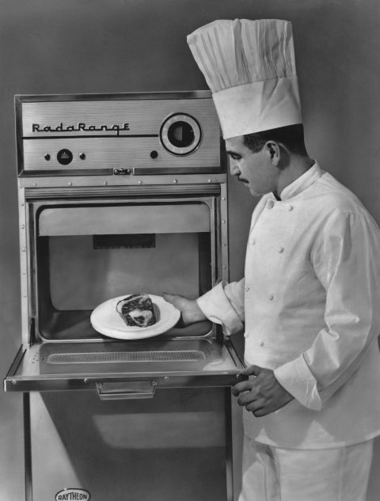

**1954**: The Radarange 1161 is 1600W like the previous model, but now completely air-cooled.

> The air in commercial kitchens is usually hot, grease laden, and frequently full of lint. … Cooling air, therefore, is drawn in at the front, where the air is most apt to be cool and free of grease … and forced over the electrical components and out through openings in the back of the cabinet.
> 
> \-- [Popular Mechanics, 1955](https://www.rfcafe.com/references/popular-electronics/radarange-march-1955-popular-electronics.htm)

*Why is the air in commercial kitchens "frequently full of lint"? Yuck.*

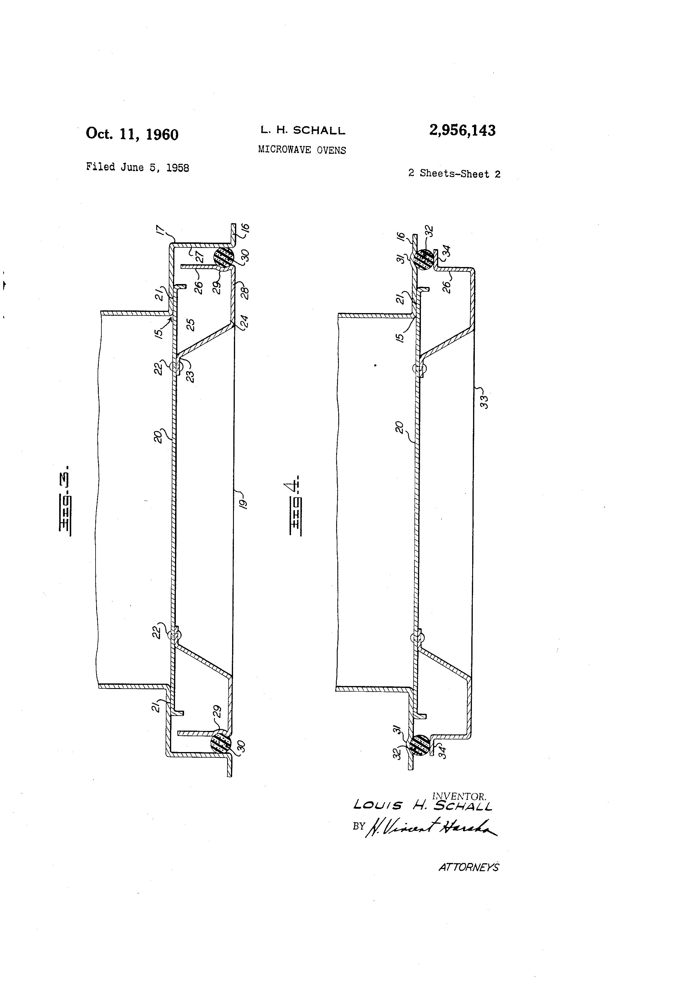

Microwaves cook meat well. At the time of writing, you, dear reader, are unfortunately [made of meat](https://www.mit.edu/people/dpolicar/writing/prose/text/thinkingMeat.html). It is therefore of utmost importance that the box keeps microwaves inside the box, while also offering a convenient door to open the box.

> The cooking chamber is similar to a Faraday cage to prevent the waves from coming out of the oven. Even though there is no continuous metal-to-metal contact around the rim of the door, choke connections on the door edges act like metal-to-metal contact, at the frequency of the microwaves, to prevent leakage.
> 
> \-- [Wikipedia](https://en.wikipedia.org/wiki/Microwave_oven)

*For a heated discussion on microwave door seals, I refer you to [this forum thread from 2015](https://www.edaboard.com/threads/microwave-oven-door-perimeter-seal.332934/), which has been archived [here](https://taylor.town/microwave-oven-door-perimeter-seal.webarchive).*

As an additional layer of protection, opening the oven oven door breaks the magnetron's power circuit. This pretty much guarantees that microwaves stay inside the metal box, where they belong.

Speaking of heating meat--

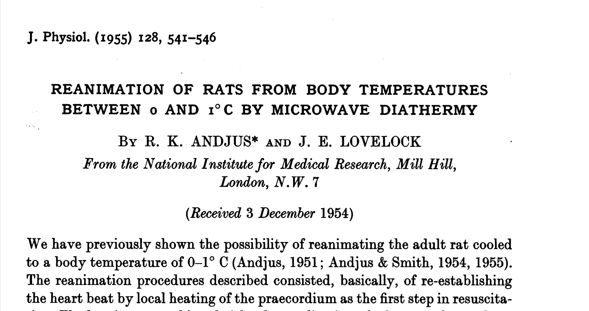

**1954:** [James Lovelock](https://en.wikipedia.org/wiki/James_Lovelock) et al. reanimated [cryogenically-frozen](https://en.wikipedia.org/wiki/Cryogenics) hamsters using an ad-hoc microwave oven.

*I highly recommend watching [Tom Scott's interview with James Lovelock](https://www.youtube.com/watch?v=2tdiKTSdE9Y) for more details.*

Meanwhile, weird microwave experiments [continued throughout the fifties](https://taylor.town/microwaves.pdf):

> They ranged from economically unfeasible applications, like sterilization of soil, through many food applications, like blanching mushrooms, to specialized jobs, like warming frozen horse serum.

Okay, sorry, back to the ovens.

Note that in 1954 the microwave oven already has a nifty window for creeping on your food.

> The oven door usually has a window for easy viewing, with a layer of conductive mesh some distance from the outer panel to maintain the shielding. Because the size of the perforations in the mesh is much less than the microwaves' wavelength (12.2 cm for the usual 2.45 GHz), microwave radiation cannot pass through the door, while visible light (with its much shorter wavelength) can.
> 
> \-- [Wikipedia](https://en.wikipedia.org/wiki/Microwave_oven)

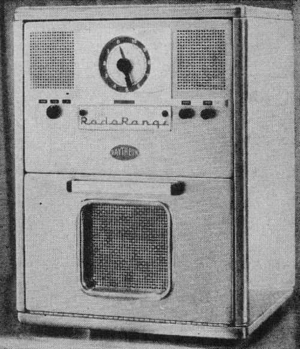

**1955:** The Radarange 1170 is a 800W air-cooled countertop model.

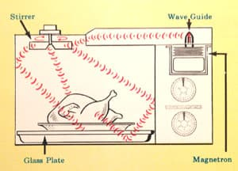

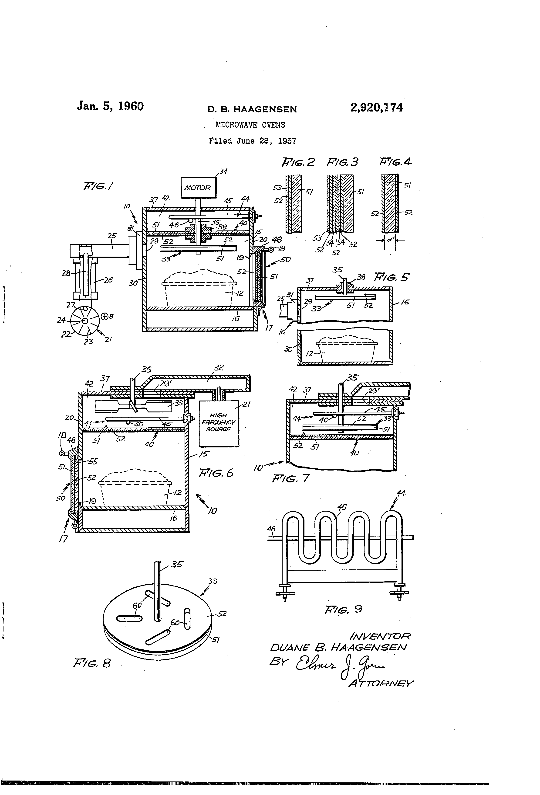

By the mid 1950s, the major components of the modern microwave oven have been established: it's a ~2.4GHz magnetron plus wave-scatterers on a ventilated metal box with a fancy door.

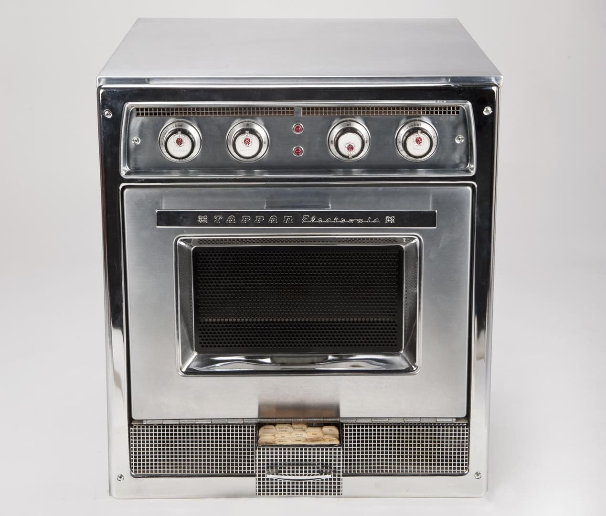

*My favorite feature is that adorable recipe drawer.*

**1955:** With Raytheon's licensed technology, the Tappan RL-1 became the first consumer microwave oven on the market [for $1,295](https://spectrum.ieee.org/a-brief-history-of-the-microwave-oven) (~$15k today).

*I found a video of this model [working 57 years later](https://www.youtube.com/watch?v=GjNVfGDopt8) (plus a [fun discussion](https://www.automaticwasher.org/cgi-bin/TD/TD-VIEWTHREAD.cgi?56587_31)).*

But what's with the extra knobs?

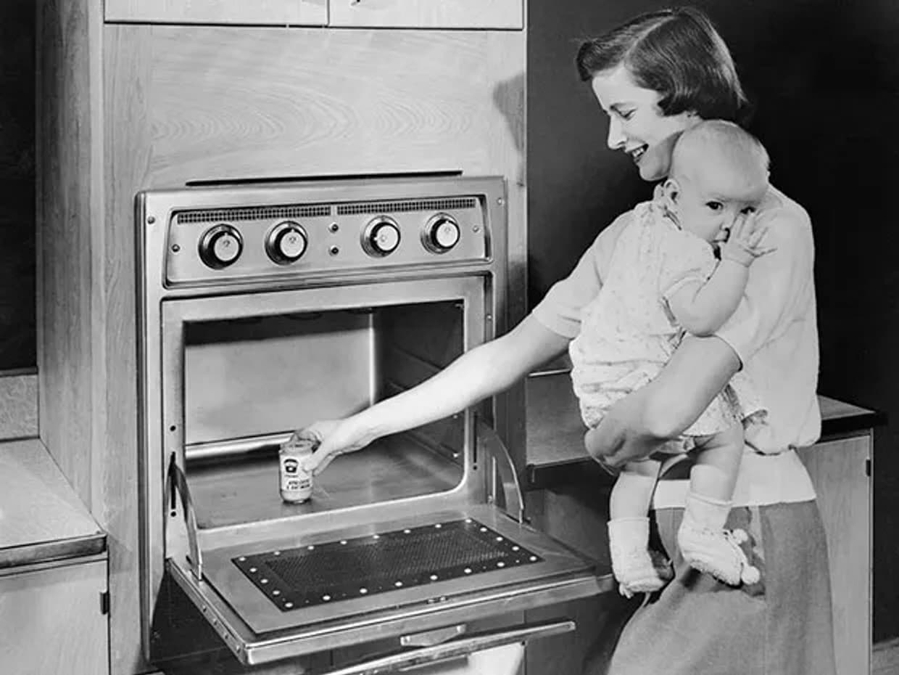

*Resist temptation -- [never put your child in a microwave oven](https://www.reddit.com/r/notinteresting/comments/1fw3qrn/my_microwave_asking_for_sacrifices/).*

The RL-1 had a "browning element" AKA "thing that gets really hot" AKA "broiler" AKA [upside-down grill](https://en.wikipedia.org/wiki/Grilling).

*The convection oven in your kitchen probably has a broiler; nowadays that's the quickest ticket to brown town.*

As intuition suggests, microwaves rarely brown/caramelize foods. This is because microwave ovens do not excite water molecules hot enough to produce [Maillard reactions](https://en.wikipedia.org/wiki/Maillard_reaction) (and other chemistry).

*With browning, it's "cooking"; without browning, it's mere "reheating".*

But that's just water -- microwaves [make fats/oils really hot](https://en.wikipedia.org/wiki/Microwave_oven). Dishes with sufficient fat content can emulate some oil-based browning methods.

*This is why saccharine and/or fatty foods can become unexpectedly hot and melt plastic cookware.*

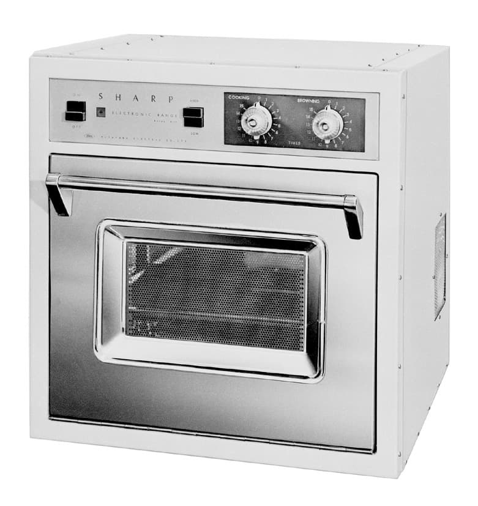

**1962:** Sharp mass-produces the R-10, their first major microwave oven.

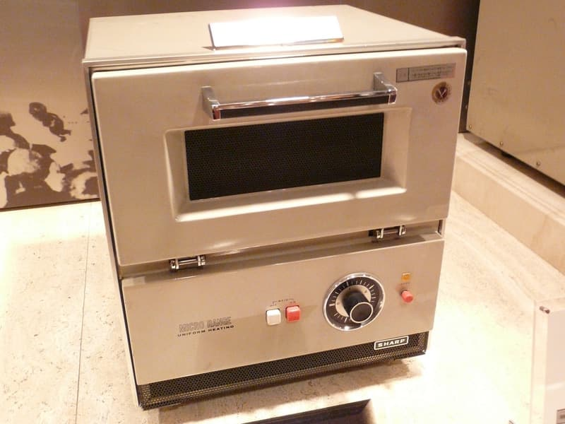

**1966:** [For only ¥200K](https://spectrum.ieee.org/microwave-oven) (~$6k USD today), the Sharp R-600 is the first microwave oven with a spinning plate to heat food more uniformly.

*Unfortunately, I couldn't find an image of the spinning plate. You'll have to use your imagination.*

To this day, that spinning plate remains a hot debate. Luckily, you can compare ovens' spinning/stirring strategies with [thermal paper](https://www.youtube.com/watch?v=7FhwTelc5Tg) and/or [toast](https://www.cnet.com/home/kitchen-and-household/appliance-science-experiments-mapping-your-microwave-hot-spots/):

> The location of dead spots and hot spots in a microwave oven can be mapped out by placing a damp piece of thermal paper in the oven: When the water-saturated paper is subjected to the microwave radiation it becomes hot enough to cause the dye to be darkened which can provide a visual representation of the microwaves. If multiple layers of paper are constructed in the oven with a sufficient distance between them a three-dimensional map can be created. Many store receipts are printed on thermal paper which allows this to be easily done at home.
> 
> \-- [Wikipedia](https://en.wikipedia.org/wiki/Microwave_oven)

**1965:** Raytheon acquires Amana Refrigeration to manufacture a consumer microwave oven for the US market. With the help of New Japan Radio Company, Raytheon [prototyped a cheap magnetron](https://taylor.town/microwaves.pdf) for use in the new ovens.

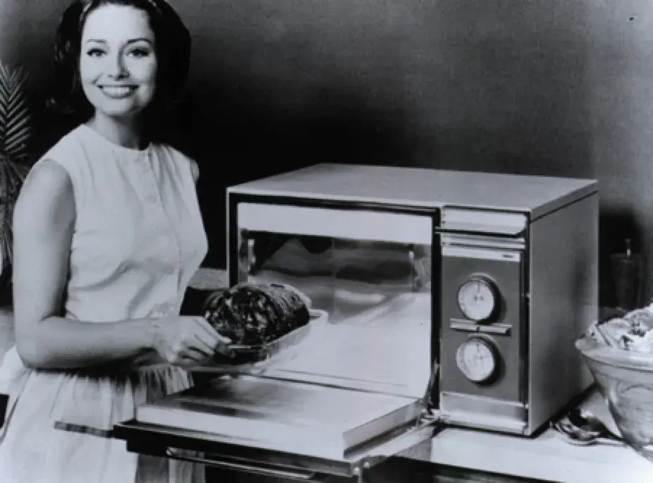

**1967:** [For $495](https://spectrum.ieee.org/a-brief-history-of-the-microwave-oven) (~$4.5k adj.), the Amana RR-1 is an overwhelming success.

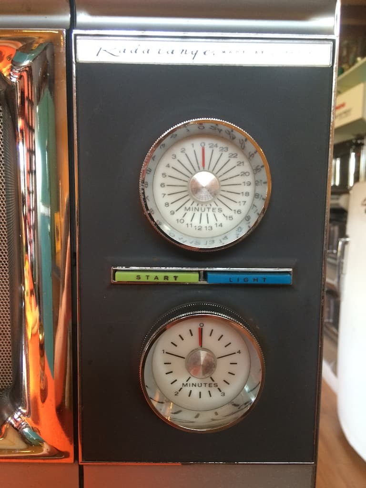

*Surprise! The top knob adds 25-minute increments; the bottom knob adds 5-minute increments -- definitely no "+30s" button.*

*People are no longer accustomed to [30-minute recipes](https://www.reddit.com/r/shittyfoodporn/comments/18iow73/microwave_on_high_for_3033_minutes/) nor [related controls](https://www.reddit.com/r/CasualUK/comments/17vefuk/why_does_the_microwave_go_up_to_35_minutes_has/).*

*

In reality, [you *can* put metal in the microwave](https://en.wikipedia.org/wiki/Microwave_oven), but you *shouldn't*:

> Microwaving an individual smooth metal object without pointed ends, for example, a spoon or shallow metal pan, usually does not produce sparking. Thick metal wire racks can be part of the interior design in microwave ovens [(see illustration)](https://en.wikipedia.org/wiki/File:Microwave_metal_shelf.webp).

Beyond being a fire hazard, many people feared the microwave oven for leaking harmful radiation.

**1968:** Congress passes [the Radiation Control for Health and Safety Act](https://en.wikipedia.org/wiki/Radiation_Control_for_Health_and_Safety_Act_of_1968).

I'll spare you [the boring details](https://taylor.town/microwaves.pdf) -- microwave ovens were doled stringent constraints, and [10%-30% of older models](https://taylor.town/microwaves.pdf) had to be retrofitted to comply with the new law. This harmed public opinion of microwave ovens and their manufacturers.

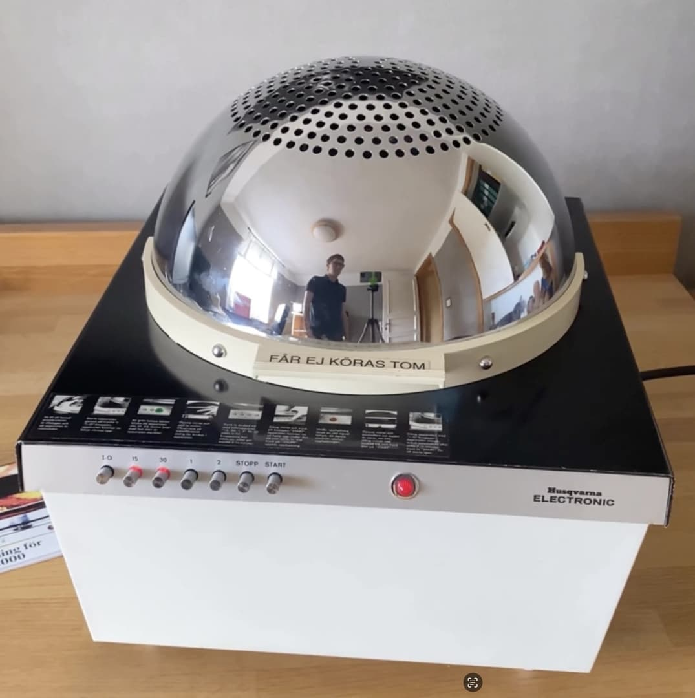

**1968** Husqvarna makes the [Cupol](https://www.youtube.com/watch?v=DZLMiUEVKNM) oven.

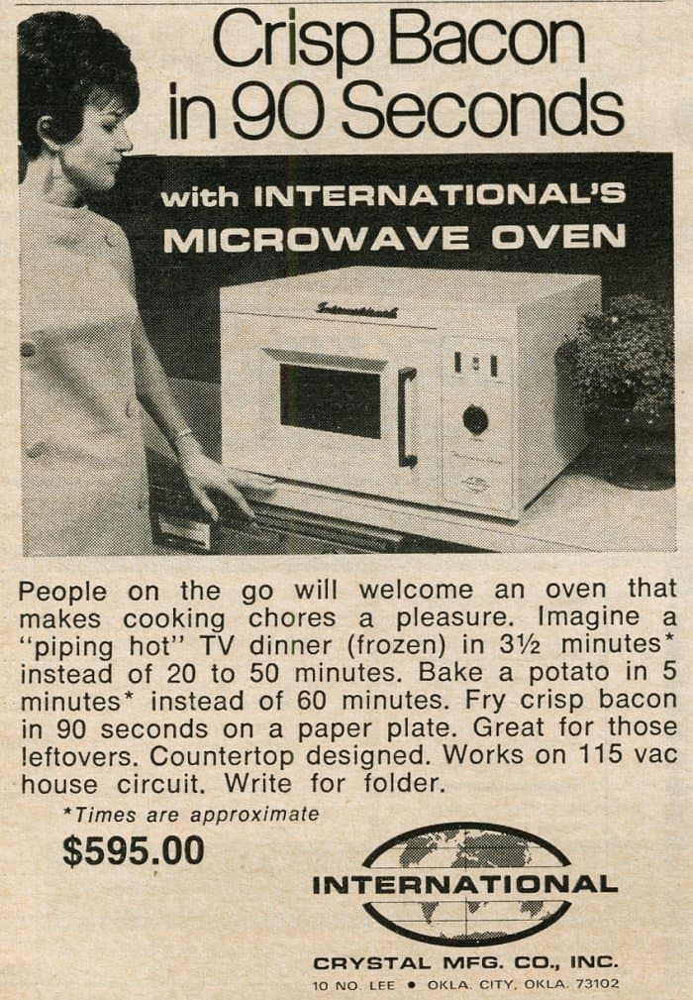

**1969:** Despite the public scare, microwave advertisements begin in earnest.

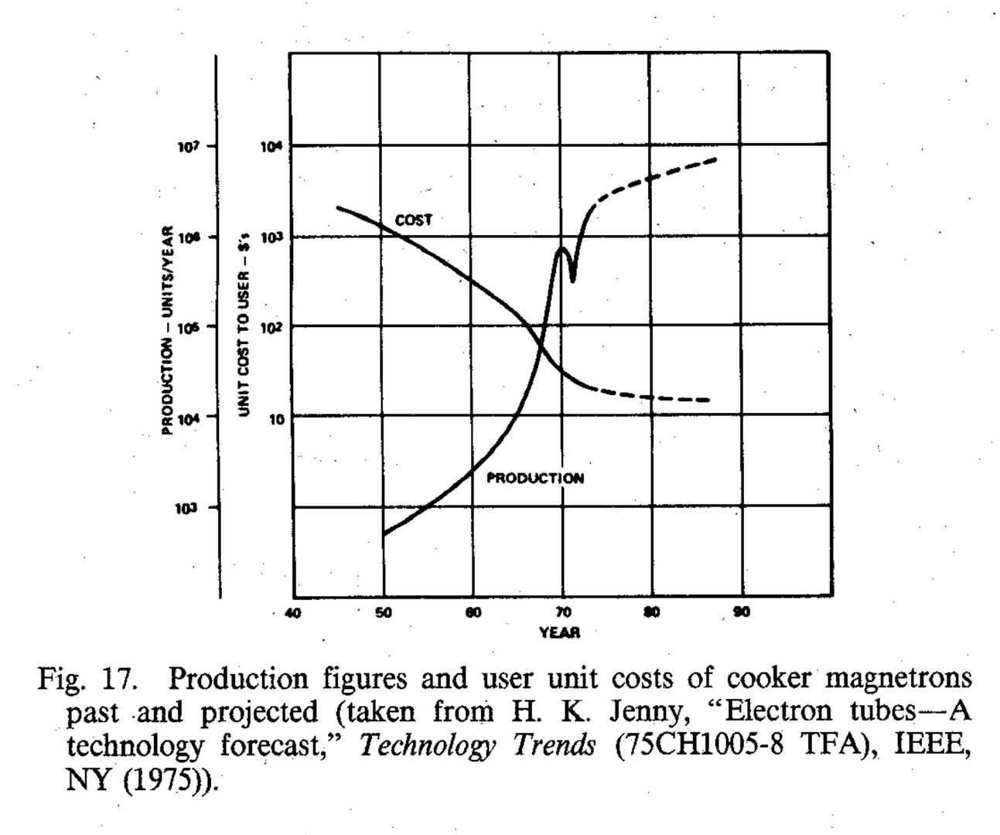

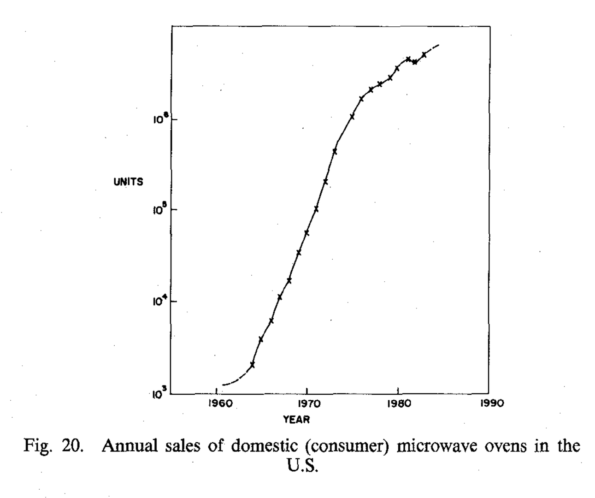

> While uncommon today, combination microwave-ranges were offered by major appliance manufacturers through much of the 1970s as a natural progression of the technology. Both Tappan and General Electric offered units that appeared to be conventional stove top/oven ranges, but included microwave capability in the conventional oven cavity. Such ranges were attractive to consumers since both microwave energy and conventional heating elements could be used simultaneously to speed cooking, and there was no loss of countertop space. The proposition was also attractive to manufacturers as the additional component cost could better be absorbed compared with countertop units where pricing was increasingly market-sensitive.
> 
> \-- [Wikipedia](https://en.wikipedia.org/wiki/Microwave_oven#Residential_use)

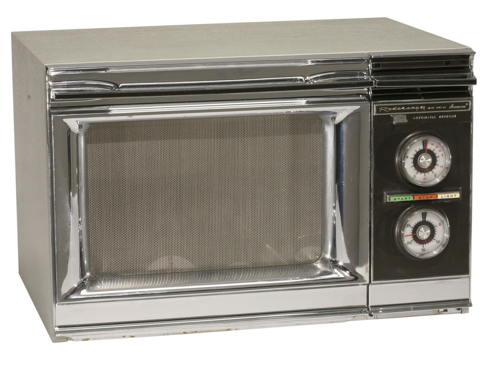

**1974:** The Amana RR-4D is the first microwave oven with an "auto-defrost" mode, which switches the magnetron on/off every few seconds.

Because [solid water molecules](https://en.wikipedia.org/wiki/Ice) are practically immune to dielectric heating at this frequency, it's better to use lower power for longer durations. This causes the excited water to slowly/uniformly thaw neighboring ice and eventually slow-cook the whole meal.

But why does the magnetron switch on/off to achieve "lower power"? It's all about photons:

- Everybody shares the same airspace. Government agencies (e.g. FCC) coerce manufacturers into cooperative strategies that minimize photon pollution.
- Microwave oven manufacturers are only allowed to use specific photon power-levels (e.g. 2450MHz).
- Power is "energy-per-second". To make a lower-power "defrost" mode with those assigned photons, engineers simply have to send fewer photons per second.
- Historically, the cheapest/easiest way to tune photons-per-second has been to switch the magnetron on/off at different intervals. This remains true until the introduction of *inverters* -- but more on that later.

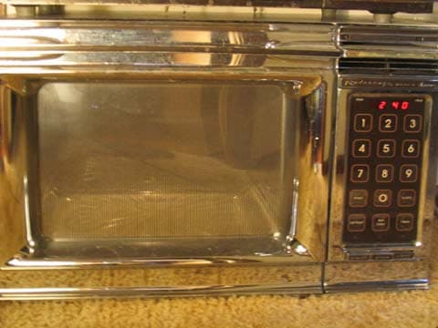

**1975:** The Amana RR-6 is the first microwave oven with a digital interface.

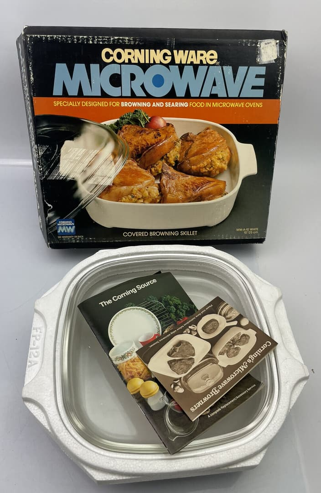

**1977:** The popularity of the microwave spawned secondary markets for specialized tools and methods.

> Made by Corning Glass Works for Amana, they had browning surfaces coated with tin oxide. The dishes had to be preheated empty in the Radarange. The coating would absorb the microwaves, causing the surface to become hot and turn yellow. Food pressed onto these surfaces would brown in 1 to 2 minutes, and then you’d flip it to brown the other side. Sure, you could achieve the same results in a skillet on your stove, but you have to admire the ingenuity at work here.
> 
> Included in all the cookware booklets are recipes. I love experimenting with recipes from old cookbooks, but some of these seem like a stretch. Would you really use your Amana Radarange Popcorn Popper to make popcorn, which you then grind up and add to meatloaf, which you then cook in your Amana Radarange?
> 
> \-- [Always Break the Yolks](https://spectrum.ieee.org/microwave-oven)

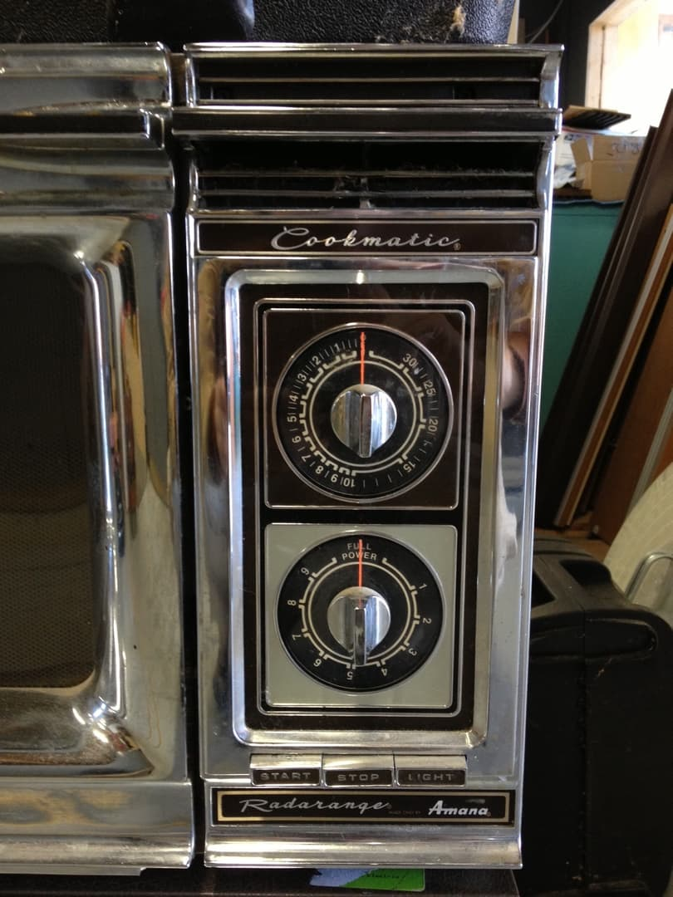

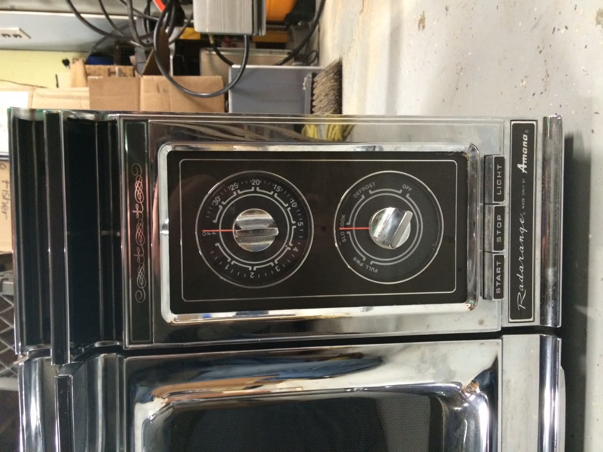

**1979:** The Amana RR-7 series, replaces the 25/5 dials with one time dial and one power dial. The power dial adjusts the magnetron [duty cycle](https://en.wikipedia.org/wiki/Duty_cycle) between 10% and 100%.

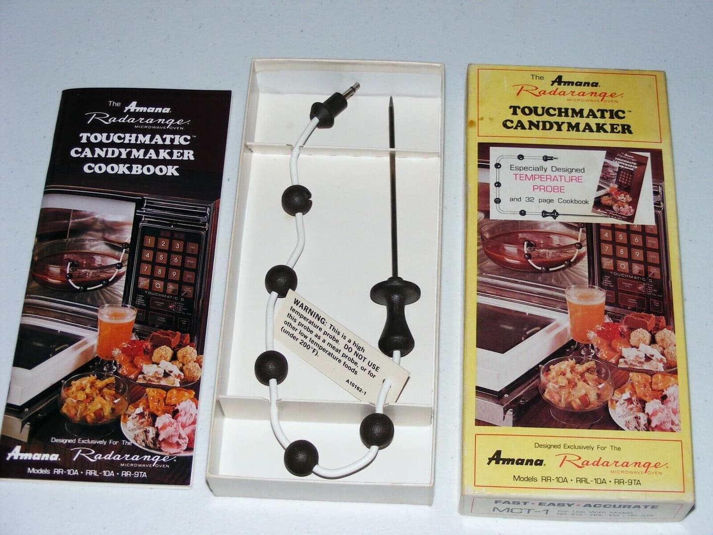

**1978:** Amana ships temperature probes with its RR-8 model.

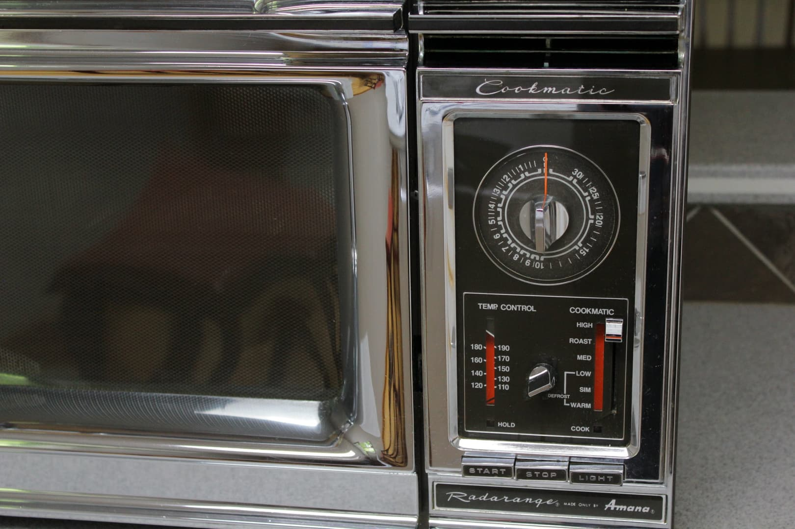

**1978:** When the probe is plugged in, the RR-8 cooks until the configured temperature threshold is met, then maintains warmth.

![Microwave oven employing a gas sensor (Sharp)

**1979:** Sharp patents a microwave oven with probe-free sensor reheating.

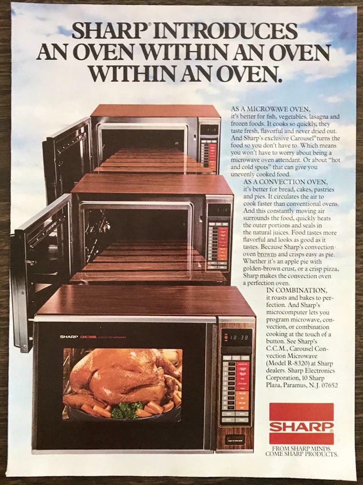

**1981:** Sharp releases a premium convection/microwave oven with spinning plate.

> A variant of the conventional microwave oven is the convection microwave oven. A convection microwave oven is a combination of a standard microwave oven and a convection oven. It allows food to be cooked quickly, yet come out browned or crisped, as from a convection oven. Convection microwave ovens are more expensive than conventional microwave ovens. Some convection microwave ovens—those with exposed heating elements—can produce smoke and burning odors as food spatter from earlier microwave-only use is burned off the heating elements. Some ovens use high speed air; these are known as impingement ovens and are designed to cook food quickly in restaurants, but cost more and consume more power.
> 
> \-- [Wikipedia](https://en.wikipedia.org/wiki/Microwave_oven)

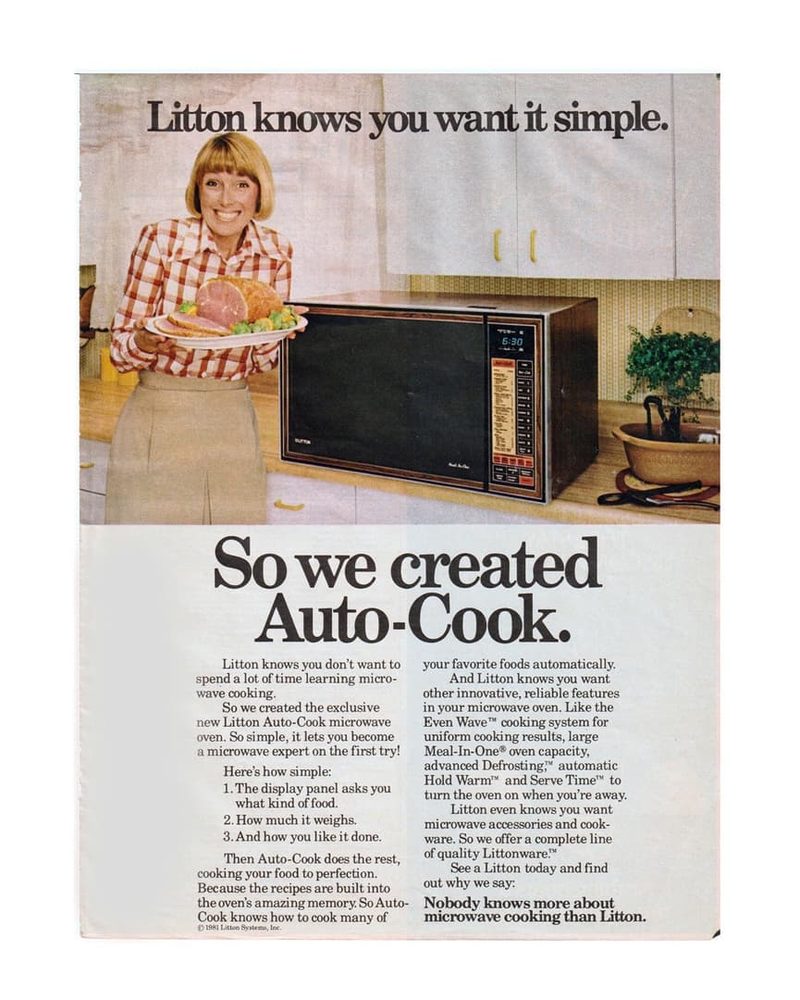

**1983:** Litton launches weight-based auto-cook.

*That microwave is huge!*

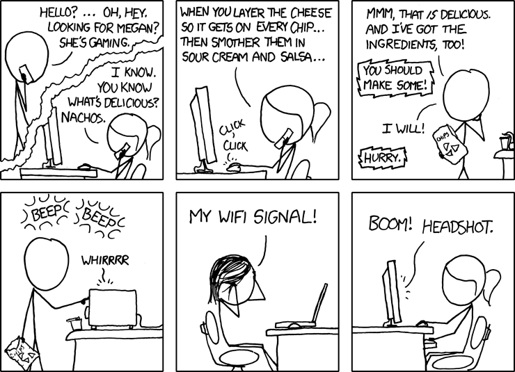

**1985:** The FCC opens the [ISM band](https://en.wikipedia.org/wiki/ISM_radio_band) to low-power communications.

*Long story short: this is why microwaves mess with your Wi-Fi signal. [Try it at home!](https://www.reddit.com/r/dataisbeautiful/comments/8xu89b/why_my_microwave_makes_me_lose_wifi_connection/)*

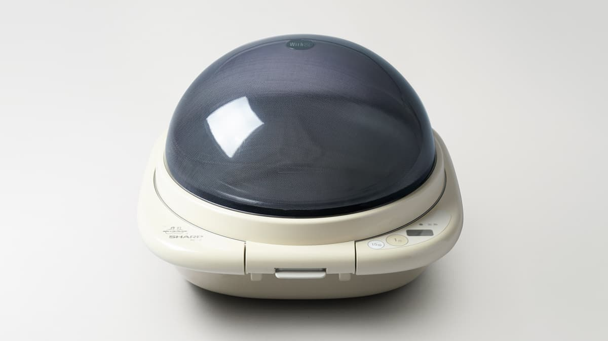

**1987:** Sharp launches the RE-2 capsule microwave.

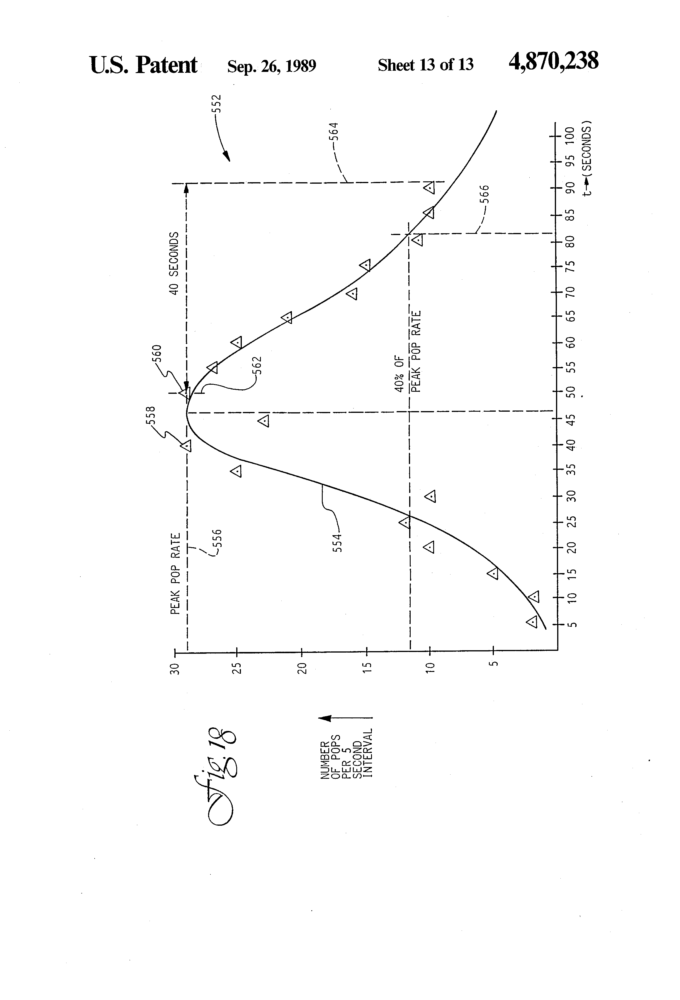

**1988:** Litton patents popcorn-mode.

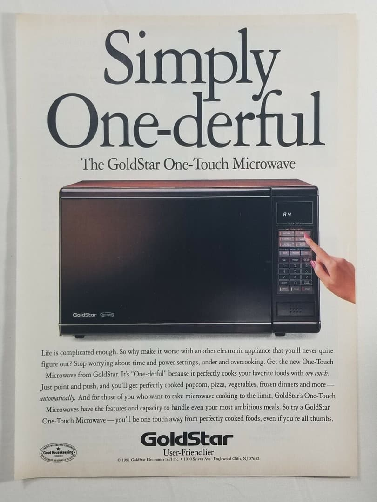

**1991:** The GoldStar One-Touch microwave button ships with buttons configured for specific foods: popcorn, pizza, vegetable, frozen dinner, baked potatoes, food plate.

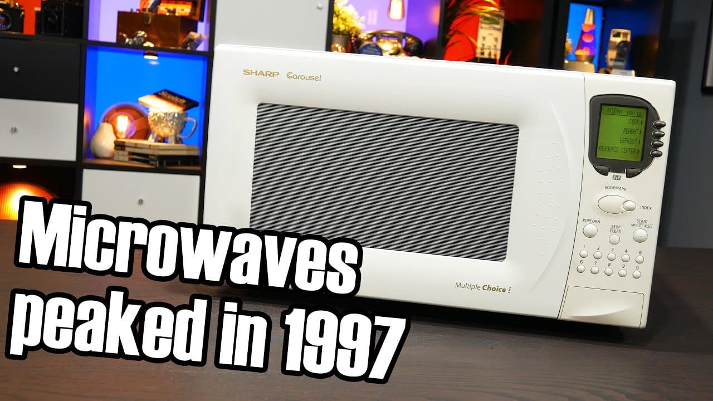

**1997:** Microwave ovens "peaked".

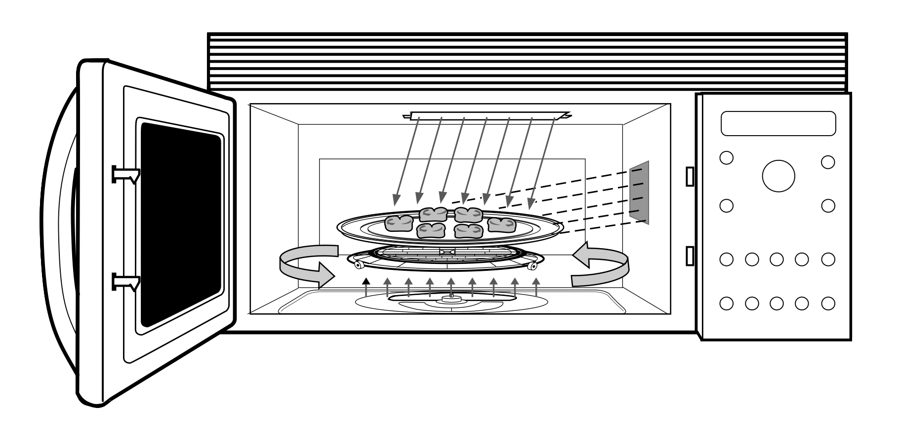

**1999:** The GE Advantium uses a quartz halogen bulb to brown food using IR.

I highly recommend [this excellent Advantium review from an amateur chef](https://consciouskitchenremodel.blogspot.com/2009/10/advantium-first-review.html). There are also great cooking experiments from publications like [The Journal of Food Engineering](https://www.sciencedirect.com/science/article/abs/pii/S0260877404005242):

> In this study, the effects of different baking methods; microwave, IR and IR-microwave combination were compared. Microwave baked cakes had some quality defects such as lack of colour, high weight loss, very firm texture and low volume. It is not advisable to bake cakes by using only IR since the product has a very thick crust and baking time is not less than IR-microwave combination baking.

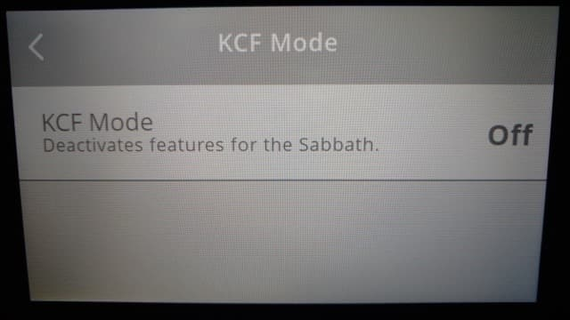

**2001**: Whirlpool launches [STAR-K](https://www.star-k.org/articles/kashrus-kurrents/483/the-sabbath-mode/) appliances with [Sabbath mode](https://en.wikipedia.org/wiki/Sabbath_mode).

*If you're hungry for historical context, check out [this journal article from 1990](https://taylor.town/microwave-sabbath-1990.pdf) and [this paper from 2012](https://taylor.town/limited-electronics-spitz.pdf).*

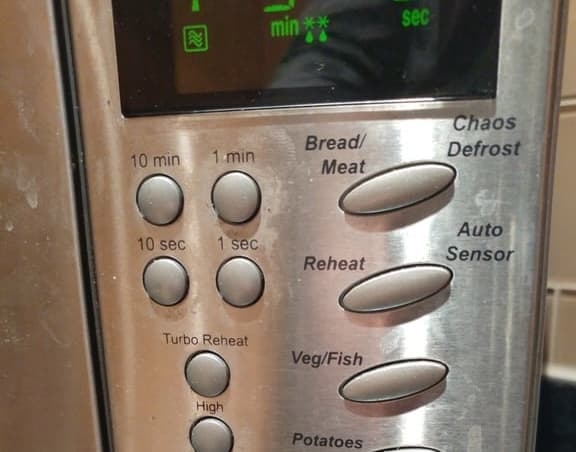

**2003:** Manufacturers claim "chaos defrost" heats food more evenly with irregular duty cycles.

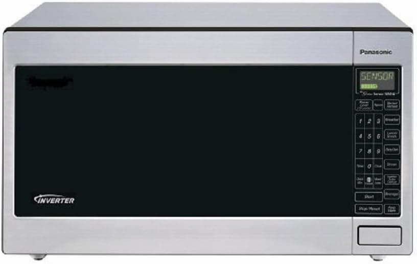

**2009:** Panasonic's inverter tech turns the microwave oven world *upside-down*! Improvements to the magnetron power supply enable the oven to more consistently heat foods at lower power levels (i.e. defrosting).

> Inverter means it uses a solid state switching power supply to control the magnetron vs the old steel core transformer and a relay. An older microwave can only switch the full power ON/OFF with slow (10s of seconds) variable duty cycle (ratio of on/off time) whereas the inverter can vary the output power in smaller gradients which has a less detrimental effect to foods with thin skins or constrained areas (like eggs). The result is less popping, bursting, spitting and splatter, fewer hot spots.
> 
> \-- [humbummer](https://www.reddit.com/r/IsItBullshit/comments/xoonjx/isitbullshit_microwave_inverter_technology/iq0rmq5/)

One downside of inverters is that they thoroughly trounce nearby Wi-Fi networks:

> Conventional transformer ovens do not operate continuously over the mains cycle, but can cause significant slowdowns for many metres around the oven, whereas inverter-based ovens can stop nearby networking entirely while operating.
> 
> \-- [Wikipedia](https://en.wikipedia.org/wiki/Microwave_oven#Interference)

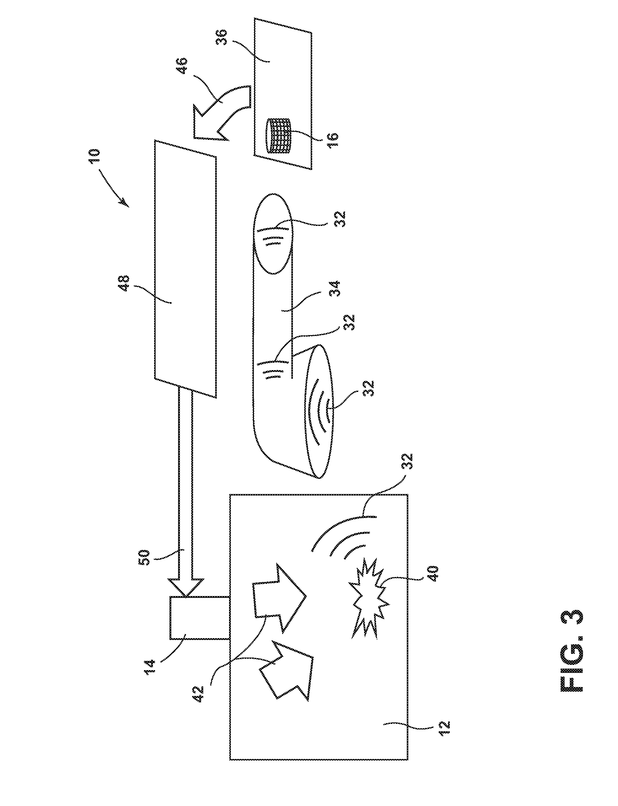

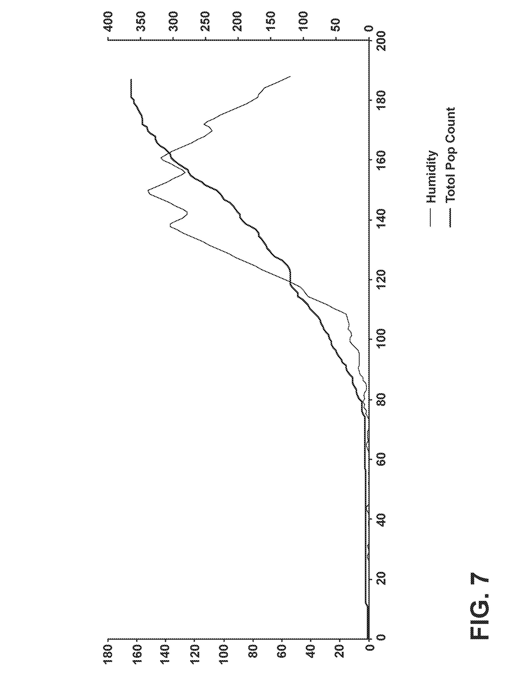

**2014:** Whirlpool's [patent for sound-based popcorn cooking](https://patents.google.com/patent/US20160205973A1/en) hits shelves with the [WMH76719CS](https://www.ajmadison.com/cgi-bin/ajmadison/WMH73521CW.html?srsltid=AfmBOoocPpsUnA7bW6Zm3_MlriHr6NbG3_8vYokaM28RKBnzYzKsI3PZ).

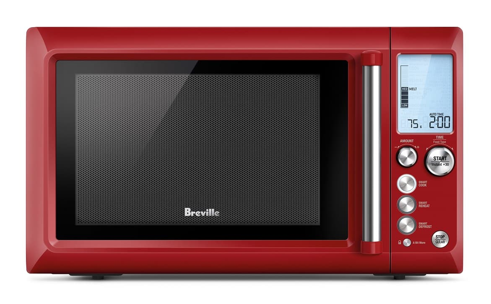

**2015:** Breville makes a beautiful microwave oven with "a bit more".

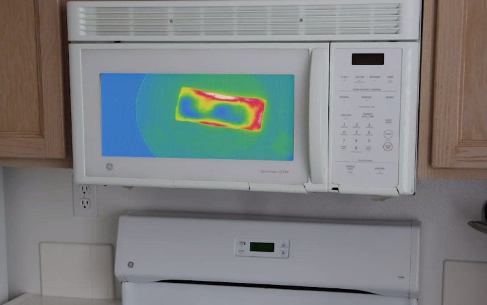

**2015:** Mark Rober builds [a microwave oven with a heatmap screen](https://www.youtube.com/watch?v=ptkzzNaZb7U).

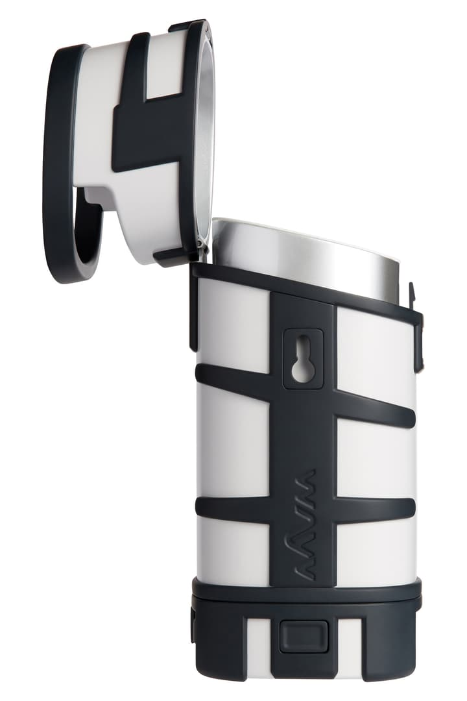


**2015:** [Advances in solid-state RF technology](https://ieeexplore.ieee.org/stamp/stamp.jsp?tp=&arnumber=7173133) prompt a new wave of sleek concept ovens.

> Solid-state microwave ovens offer improved energy distribution and cooking precision compared to magnetron-powered ovens. Frequency agility allows for more uniform energy distribution across the load by using frequency variations of ±50 MHz around 2.45 GHz, optimizing energy patterns. In multichannel systems with multiple power amplifiers and antennas, phase shifters modify the field distribution for greater homogeneity. Both frequency and phase agility adjust RF power to match load conditions, ensuring high efficiency (over 90%) even for small loads. High-resolution RF power control prevents overcooking, especially for delicate foods, and forward/reflected power measurement enables precise energy delivery and consistent cooking results.

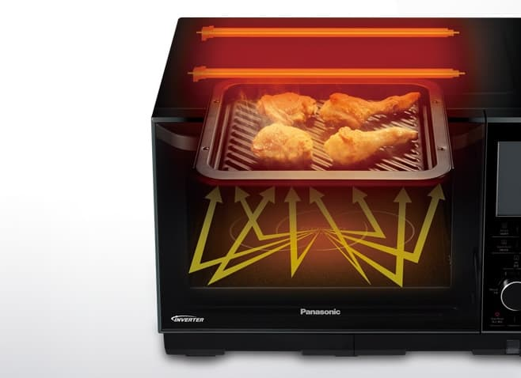
.webp)

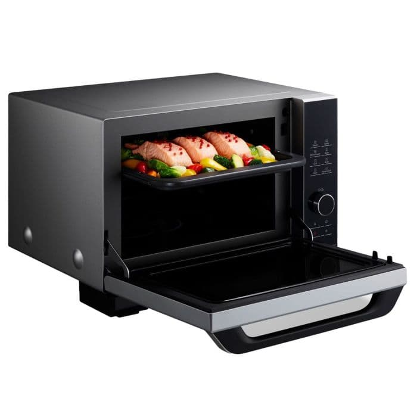

**2017:** Panasonic brings back browning elements.

> Some foods cooked in a microwave can have soft, soggy crusts. The Panacrunch Pan accessory crisps and browns pizzas, quiches, pies, and breaded products like a conventional oven. The Panasonic Panacrunch Pan works in three ways: it heats the pan by absorbing microwaves, heats the food directly with microwaves, and heats the food through the grill. The pan’s base absorbs microwaves and transfers them into heat, which is then conducted to the food. The non-stick surface maximizes the heating effect.
> 
> \-- [Panasonic NN-GD368M manual](https://www.manualslib.com/manual/1178997/Panasonic-Nn-Gd368m.html?page=18)

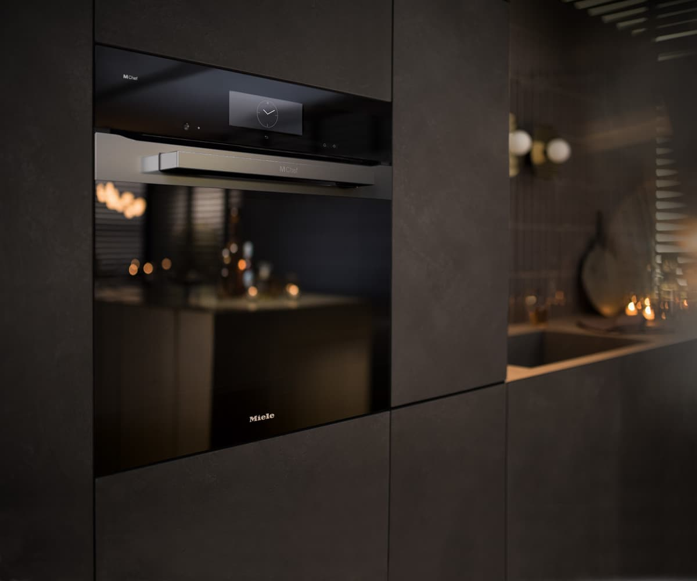

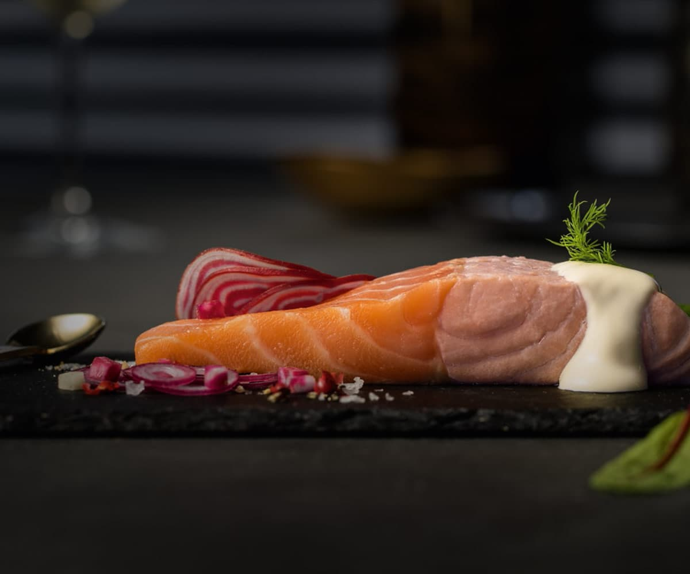

**2017:** The [Miele Dialog](https://www.miele.com/brand/en/revolutionary-excellence-38683.htm) ([demo](https://www.youtube.com/watch?v=wMwjHnspohU)) cooks with a feedback loop of RF transmitters/sensors.

By finely adjusting frequency/phase/amplitude, the Dialog can [cook exactly half a salmon](https://reviewed.usatoday.com/ovens/features/we-tried-an-oven-that-cooks-by-listening-to-your-food-and-its-amazing-miele-dialog). If soggy salmon isn't your thing, the oven also touts convection/broiler heating.

Miele's technology was [originally developed by Goji](https://spectrum.ieee.org/israeli-startup-goji-is-planning-the-oven-of-the-future) ([demo](https://www.nxp.com/company/about-nxp/smarter-world-videos/GOJI-RF-COOKING-DEMO)) to thaw frozen human organs (for medical use).

If you're curious about the hardware, [NXP's Smart Defrost](https://community.nxp.com/t5/NXP-Designs-Knowledge-Base/Defrost-Your-Food-in-Minutes/ta-p/1119868) probably uses similar tech:

> The source (oscillator) energy is then amplified using Laterally Diffused Metal Oxide Semiconductor (LDMOS) technology to a level of approximately 300 watts (54.8 dBm). A Smart Tuning Unit (STU) adjusts the operation of the unit to best match the properties of the selected food within the defrost chamber.
> 
> \-- [High Frequency Electronics](https://www.highfrequencyelectronics.com/index.php?option=com_content&view=article&id=1954:let-s-warm-things-up&catid=161&Itemid=189)

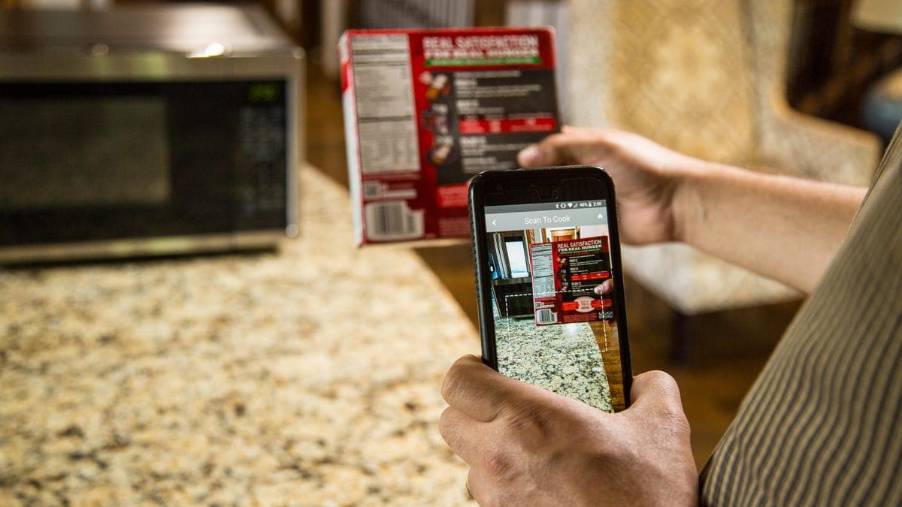

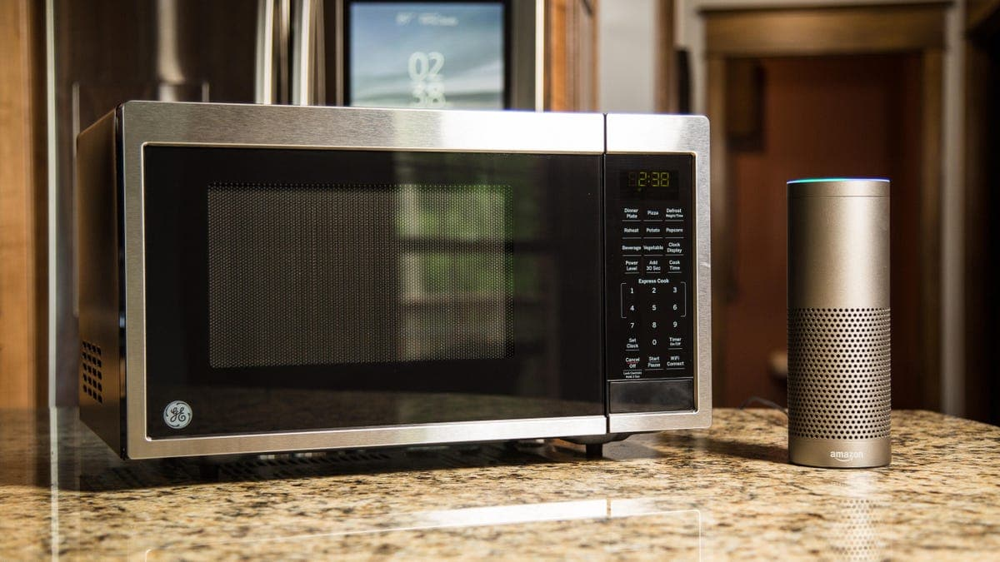

**2018:** The GE Smart Microwave Oven is Alexa-compatible and ships with a companion app.

As you'd expect, [Wired](https://www.wired.com/review/review-ge-smart-countertop-microwave-with-scan-to-cook-technology/) and [CNET](https://www.cnet.com/pictures/use-alexa-and-an-app-to-cook-with-ges-scan-to-cook-microwave/4/) both had negative experiences with the app.

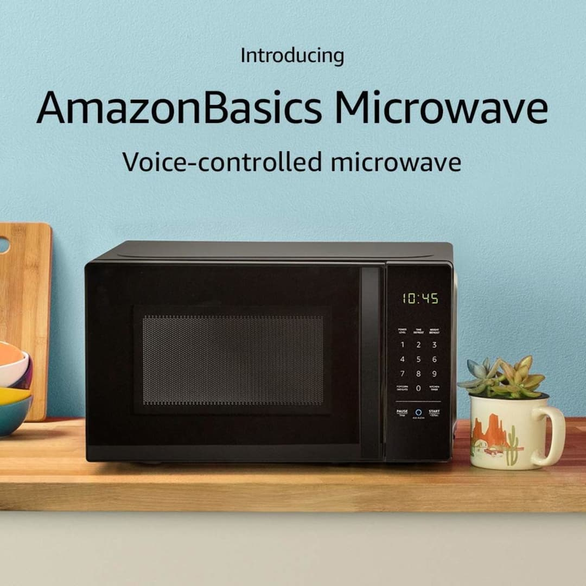

**2018:** Amazon sells a very affordable microwave with voice-controls.

> The microwave does simplify things enough so you can say, “Alexa, microwave one potato” or walk over to the microwave, tap the button, and say, “one potato.” Alexa will say, “Okay,” and the microwave will automatically be set for six minutes and 30 seconds.
> 
> … The difference is that a normal microwave will ask how heavy your potato is, but Alexa strangely doesn’t ask.
> 
> Amazon’s microwave also has a popcorn replenishment feature you can opt into that’s powered by the company’s Dash service. You can set how many bags of popcorn you have at home, and Alexa will note when you’ve microwaved a bag of popcorn and deduct the count, prompting an automatic shipment of popcorn to the address you’ve selected.
> 
> \-- [The Verge](https://www.theverge.com/2018/11/21/18103123/amazonbasics-amazon-microwave-alexa-voice-commands-review-features)

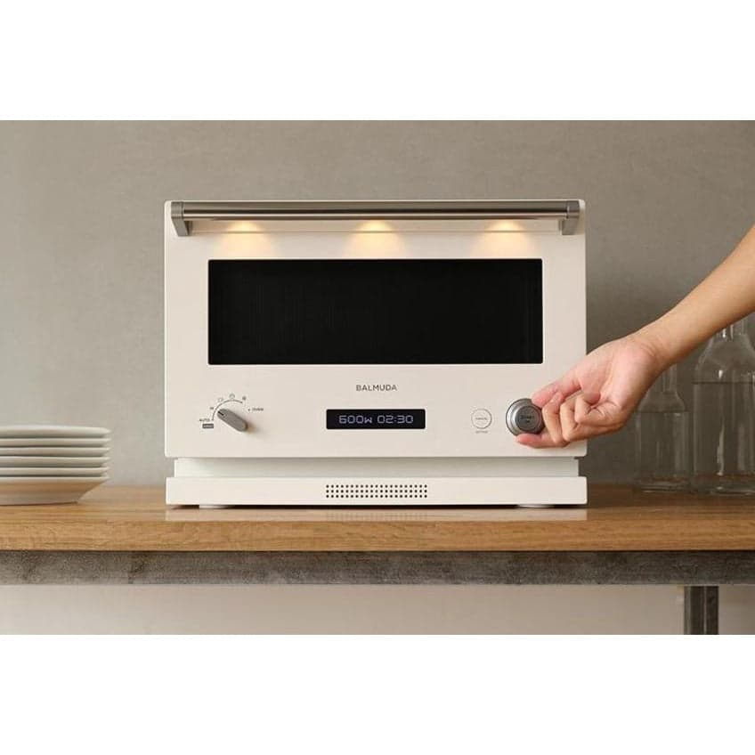

**2020:** [Balmuda](https://us.balmuda.com/) produces a gorgeous convection/microwave oven.

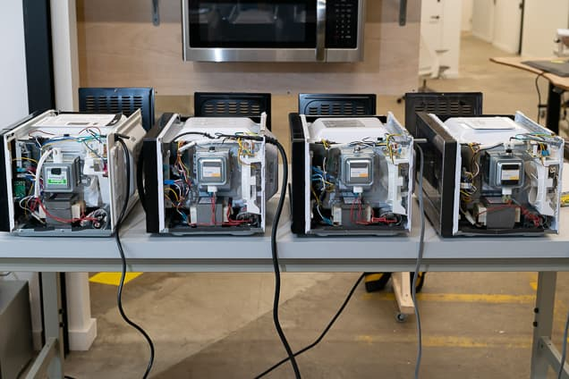

**2020:** NYT publishes a viral story about Midea-manufactured microwaves.

> We confirmed w/ Midea that it makes & sells Toshiba, Comfee, & Black+Decker ovens. We’re also confident that GE, Whirlpool, Breville, Insignia, & others also sell microwaves that were built & likely designed by Midea, though all parties that we contacted declined to comment.
> 
> Galanz (a 30-min drive away from Midea) has a big foothold worldwide, but a small share of the US market
> 
> LG & Samsung make their own microwaves
> 
> Panasonic makes its own mid-range & high-end units, but budget models seem to be made by Midea
> 
> \-- [NYT Wirecutter](https://x.com/wirecutter/status/1263549118443552768)

To be clear, NYT's tweets were not investigative -- Midea's production volume was already notable in the 1990s:

> Midea, which started producing microwave ovens in 1999, had seized 9.5 per cent of the market share by the end of 2001, joining the country's top three in the sector.
> 
> According to statistics from the China Household Electrical Appliances Association, in the first four months of the year, Galanz led the market with a share of 56 per cent, with LG following next with 23 per cent.
> 
> US brand Whirlpool announced in April it would move its two microwave oven product lines from Sweden to Shunde, a city in Guangdong Province, and increase investment by US$6 million to expand its annual production volume in Shunde from 1.3 million sets to 2 million sets.
> 
> \-- [china.org.cn](http://www.china.org.cn/english/BAT/36577.htm)


**2023:** Makita [sells a 500W battery-powered microwave oven](https://www.youtube.com/watch?v=0RYwaDaIOwk).

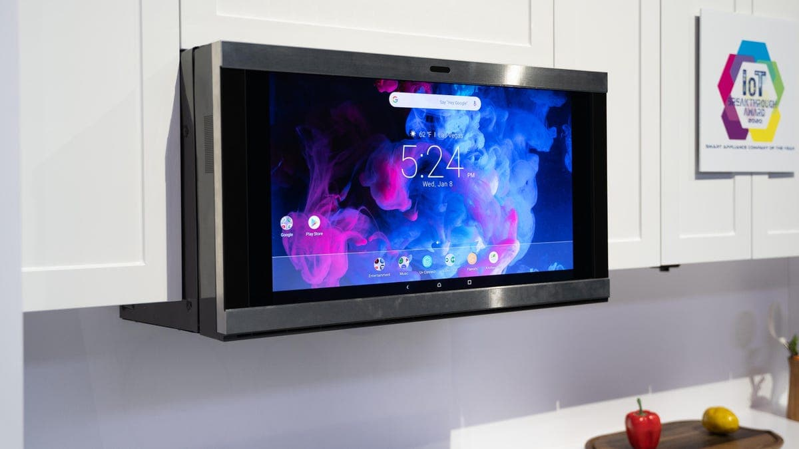

**2024:** After [its 2020 premiere](https://www.cnet.com/home/smart-home/ge-kitchen-hub-adds-a-microwave-to-kitchen-hub-touchscreen-display/), the GE Kitchen Hub 2 has yet to hit shelves.

*[B\*tches be like: "I got my first kiss today omggg" B\*tch i got my first Toshiba EM131A5C-BS Microwave Oven with Smart Sensor Easy Clean Interior, ECO Mode and Sound On-Off, 1.2 Cu. ft with Black Stainless Steel](https://www.reddit.com/r/teenagers/comments/q9yf8g/bitches_be_like_i_got_my_first_kiss_today_omggg/)*