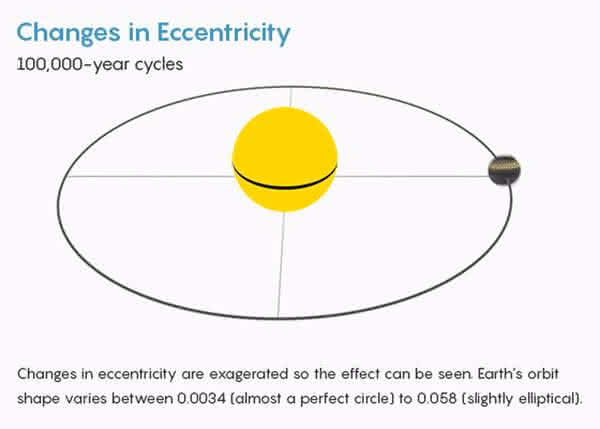
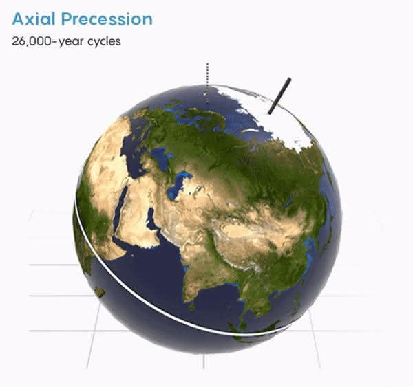
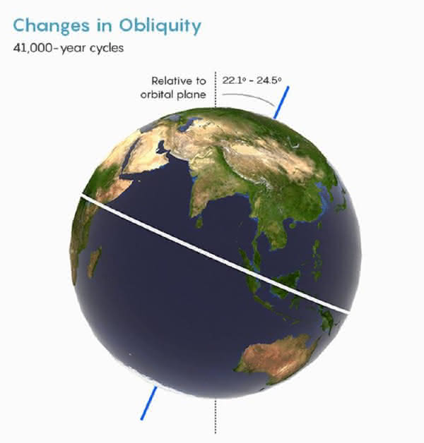

```
Date: 2020.07.31
Translator: icosohedral
Source: https://jandan.net/p/107539
OrigSource: https://www.quantamagazine.org/how-earths-climate-changes-naturally-and-why-things-are-different-now-20200721
```

# 地球气候的自然变化方式，以及我们是否应该对全球变暖负责

地球曾是个雪球，也曾是个温室，如果在人类之前的气候就是如此多变，那我们如何能确信自己应该为全球变暖负责呢？

部分原因在于，我们可以清晰的得到人类活动排放的二氧化碳与工业化以来1.28摄氏度（持续上升中）的全球暖化之间的因果联系。二氧化碳分子可以吸收地表反射的红外辐射，所以随着大气中的二氧化碳含量增加，将会有更多的热量被保留在地球中。

古气候学家们对地球历史上的气候变化也做了详尽的研究，以下是主要的10种气候自然变化方式，以及它们与当今气候变化的对比。

## 太阳周期

- 规模：0.1到0.3摄氏度的降温
- 时间：每隔几个世纪会有30-160年的太阳活动衰减

每隔11年，太阳的磁极翻转，造成以11年为周期的太阳明暗变化。但这个变化幅度非常小，对地球气候影响不大。

更强烈的变化是被称作“太阳极小期（grand solar minima）”的一个周期，在数十年间太阳活动明显减弱。该周期在过去的1.1万年里发生了25次，最近的一次发生在1645到1715年间，此次事件被称作“蒙德极小期 （Maunder Minimum）”。在蒙德极小期中，太阳的能量比现代平均水平降低了0.04%到0.08%。科学家们长期以为，是蒙德极小期带来了15到19世纪的“小冰期”，但他们后来发现这个事件对地球的影响很小，并且时间点也不准确，这个小冰期发生原因可能更多是火山活动的作用。

在过去的半个世纪里太阳略微变暗了一些，然而地球的温度却在持续上升，所以全球变暖的责任不能推给太阳。

## 火山硫

- 规模：大约0.6到2摄氏度的降温
- 时间：持续1到20年

在公元539/540年，萨尔瓦多的伊洛潘戈火山喷发，强烈的喷发柱甚至波及地球的平流层。随后，寒冷的夏季、干旱、饥荒和瘟疫席卷了全球。

大型火山喷发能把高反射性的硫酸液滴送入平流层，从而会阻挡太阳光，降低气温。接着，海洋中的冰块增加，进一步把更多的太阳光反射回太空，于是放大并延长了全球的气候变冷。

伊洛潘戈火山喷发在20年里造成了大约2摄氏度的降温。在时间上离我们更近的，发生在1991年的菲律宾皮纳图博火山喷发造成了全球气温下降0.6摄氏度，此次降温持续了15个月。

火山喷发释放进平流层的硫化物可以显著的改变气候，但从地球历史的角度上来看，这种影响非常小并且持续时间很短。

## 短期气候波动

- 规模：小于0.15摄氏度
- 时间：2到7年

除了季节变化之外，还有一些其它的短周期活动能够对降水和气温产生影响。最强烈的是厄尔尼诺-南方涛动现象（El Niño–Southern Oscillation），它涉及太平洋热带的洋流变化，以2到7年的周期显著影响北美地区的降水。北大西洋涛动（The North Atlantic Oscillation）和印度洋偶极（Indian Ocean Dipole）同样也会造成巨大的区域性影响，并且它们也能与厄尔尼诺-南方涛动现象相互作用。

这些相互关联的周期现象似乎让我们难以判断人类对气候造成的影响，难以确定我们对气候的影响是否具有统计学上的显著性，或者更多只是自然中不为人知的气候波动。但事实上，人类造成的气候变化已经远远超出了天气与季节温度变化的范围，美国气候协会在2017年总结道，“通过观测数据无法得出一个可靠的，能够解释当今气候变化的自然周期。”

## 轨道摆动

- 规模：在过去的10万年周期里大约6摄氏度，随地质时间变化。
- 时间：有规律，23,000、41,000、100,000、405,000和2,400,000年的重叠周期

地球的运行轨道会周期性的摆动，并受到太阳、月球和其它行星相对位置的影响，这种周期性的轨道变化被称作是“米兰科维奇循环（Milankovitch cycles）”，它最多能使地球中纬度地区的太阳光照变化25%，进而引发气候波动。这些周期一直在持续循环，你可以在悬崖或是道路挖掘时看到不同周期造成的沉积分层。

地球在更新纪时期的冰期就归因于米兰科维奇循环：地球轨道变化引发了北半球夏季平均温度的变化，北美、欧洲和亚洲的冰盖也随之大面积形成或消融。由于二氧化碳在温暖海洋中的溶解度更小，大气中二氧化碳含量也会随地球轨道变化而发生改变，从而放大气候的波动。
今天的地球正在接近北半球光照最小期，所以假如没有人类活动产生的二氧化碳影响，我们将在随后的1500年左右进入一个新的冰期。

  
  


上面是地球三种不同的摆动：

1. 轨道离心率，地球自身公转轨道形状的变化。
2. 进动，地球自转轴的方向变化。
3. 转轴倾角，地球自转轴相对于轨道平面的倾角变化。

## 太阳的长期光度变化

- 规模：无实质上的温度影响
- 时间：持续进行

除了短期的光度波动外，太阳每100万年会增加0.009%的亮度，如今它的亮度已经比45亿年前刚形成时增加了48%。

科学家们推测青年时期太阳暗淡的光照会使地球在最初的20多亿年里保持冰封状态，但奇怪的是，地质学家们发现了在34亿年的海浪冲击下形成的岩石。早期地球不同寻常的温暖气候或许可以通过较少的陆地侵蚀、更晴朗的天空、白天较短和特定的大气构成得到解释。

而在地球的最近20亿年里，气温仍保持稳定，这主要是因为地球的风化作用起到了恒温器的效果，它降低了更强太阳光照带来的气候影响。

## 二氧化碳与风化作用

- 规模：减缓其它气候变化的影响
- 时间：大于10万年

由于二氧化碳可在大气中长时间存在，它能保留一部分从地表反射到太空的热量，所以大气二氧化碳水平是控制地球气候的最主要因素。
火山活动、岩石变质以及沉积物中碳的氧化都会将二氧化碳释放到大气之中，但同时二氧化碳与硅酸盐反应会生成石灰岩，从而固定二氧化碳，将其埋入地底。这种平衡类似一个恒温器：当气候变暖，化学反应更加强烈，有更多的二氧化碳参与到石灰岩的生成中，于是暖化幅度就被抑制了；当气候变冷，化学反应不那么活跃，就减缓了冷却。于是，在长期时间尺度下，地球气候保持相对稳定，为我们提供了一个适宜生存的环境。此外，平均二氧化碳水平也随着太阳亮度的增长而在稳定的降低。

然而，这种风化作用恒温器需要数十万年时间来对大气中二氧化碳含量的变化作出反应。海洋的调节作用更快一些，但也需要近千年的时间，并且海洋对二氧化碳的吸收可能会过度，造成海洋酸化。如今每年燃烧化石燃料释放的二氧化碳要比火山活动高出100倍——远远超过了海洋以及风化作用的调节范围，这也是气候变暖，而海洋却持续酸化的原因。

## 板块构造

- 规模：在过去的5亿年里大概30摄氏度
- 时间：数百万年

地壳的变动可以缓慢的改变风化作用的温度控制效果。

地球在过去的5000万年里正逐渐变冷，这是因为板块间的冲撞使化学上比较活跃的岩石——比如玄武岩或火山灰——暴露在温暖潮湿的热带环境，增加了它们与大气中二氧化碳的反应几率。此外，在过去2000万年里，喜马拉雅、安第斯、阿尔卑斯以及其它一些山脉的形成也增加了岩石侵蚀速率，促进了风化作用。另一让地球冷却的因素是3570万年前南美大陆和塔斯马尼亚（现在位于澳大利亚南部）从南极大陆的分离，这个事件创造了一个环绕南极大陆的洋流。这个全新的洋流促进了这片海域的环流，增加了浮游生物的数量，从而增加了二氧化碳的消耗。此后，南极洲冰盖大幅增长。

在早先的侏罗纪和白垩纪时期，因为强烈的火山活动和较少的风化作用，恐龙得以漫步在南极大陆。当时大气中的二氧化碳水平大约为1000ppm（parts per million，百万分之一），相比之下，现代二氧化碳平均水平只有415ppm。这个无冰的世界要比现代气温高出5到9摄氏度，当时的海平面也比现在高大约76米。

## 小行星撞击

- 规模：大约20摄氏度的降温，随后5摄氏度的升温（参考6500万年前的希克苏鲁伯陨石撞击）
- 时间：持续数个世纪的降温，随后10万年的升温（参考6500万年前的希克苏鲁伯陨石撞击）

迄今为止，地球撞击数据库（Earth Impact Database）确认了190个撞击坑，除了6500万年前灭绝恐龙的希克苏鲁伯陨石撞击之外，其它撞击事件都没有对地球气候造成明显影响。计算机模型显示，希克苏鲁伯撞击产生了大量的灰尘和硫化物，它们被送入高空并遮挡了太阳光，随后地球温度下降超过20摄氏度，同时海洋也明显酸化。地球经过数个世纪才恢复到撞击之前的温度，并且由于撞击事件中墨西哥湾的蒸发的大量石灰岩，随后的气温提升了5摄氏度。
与这次撞击同时发生的，位于印度的火山活动是否参与了气候变化还有待考察。

## 生物演化

- 规模：随事件而异。在晚奥陶纪（4.45亿年前）大约5摄氏度的降温。
- 时间：数百万年

有时候，新物种形成也会打破地球的温度平衡。能进行光合作用的蓝细菌出现在大约30亿年前，它释放出的氧气显著的改变了地球大气的构成。随着蓝细菌的兴盛，大气中氧气含量从24亿年前开始上升，同时甲烷和二氧化碳水平明显下降。甲烷和二氧化碳的下降促使地球进入了一个严峻的，长达2亿年的“雪球”时期。7.17亿年前多细胞生物的大规模演化也引发了另一次“雪球”气候，这次是由于生物吸收了大气中的碳，这些碳元素随着生物残骸沉入深海，减少了大气中的碳含量。

在奥陶纪时期，陆生植物出现，陆地生物圈开始成形。陆生植物将碳埋入地底，并从陆地中吸收养分，随后这些养分经河流冲入海洋，也促进了海洋中生物的活动。这些变化或许引发了4.45亿年前的冰期。在之后的泥盆纪，树的出现进一步降低了大气中二氧化碳含量，生物演化与造山运动联手造就了古生代的冰河时期。

## 大规模熔岩

- 规模：3-9摄氏度的升温
- 时间：数十万年

规模非常巨大的熔岩被称作是大型火成岩区，它造成了地球史上多次大灭绝。这些火成活动非常致命，它能带来许多可怕的事件（比如酸雨、酸雾、汞中毒或是臭氧层破坏），同时它也会释放大量甲烷与二氧化碳到到大气中，这些气体的释放要快于风化作用的调节速度，从而造成全球温度升高。

在二叠纪-三叠纪灭绝事件中，地底熔岩引燃了西伯利亚的煤炭，使大气中二氧化碳含量上升到8000ppm，全球气温上升5到9摄氏度，81%的海洋生物消失。在5600万年前的古新世－始新世极热事件中，北大西洋底部油层中的甲烷受熔岩影响释放入大气之中，造成了5摄氏度的升温并使海洋酸化，随后短吻鳄和棕榈树在北极海岸兴盛起来。在三叠纪末期至侏罗纪早期，也发生了类似的化石碳矿床释放，继而引发了全球气温升高，部分海洋区域荒芜以及海洋酸化。

假如你感觉上述几种气候变化方式看起来很眼熟，这是因为如今人类正在对地球做同样的事。

正如一个研究三叠纪－侏罗纪灭绝事件的团队在《自然-通讯》中写道，“我们估计，三叠纪末期每个熔岩柱释放到大气中的二氧化碳与21世纪人类活动的排放量相当。”