```
Date: 2019.10.26
Author: scillidan
```

# 家具木材选购指南

## 木材市场观光

这里选取了宜家，同时也是北欧风格的家具常用的几种木材，参考国内购置成本等因素小作搜集。也有没提及的木材，如胡桃木、松木、枫木等，和更详细的次级类目等。

### 欧洲赤松、樟子松

芬兰多且名产，也称芬兰木。质地密而细，纹理均匀且直。性质上与俄罗斯樟子松相当，该树种在国内于黑龙江大兴安岭、内蒙古海拉尔山以西、小兴安岭也有分布。目前国内市场上有进口的俄罗斯樟子松，品性略好于东北樟子松。因生长环境更偏北，通常树节更少、油性更小、纹理更细也更清晰。这三种木材，经处理后，抗干裂防腐蚀、抗霉菌防白蚁，十分适合做露台地板、庭园栈道、室外家具等。

是朴素实用，更适用于户外的木材。

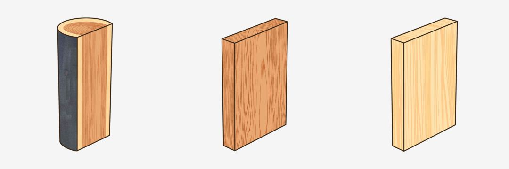  
芬兰木纵切面、心材、边材

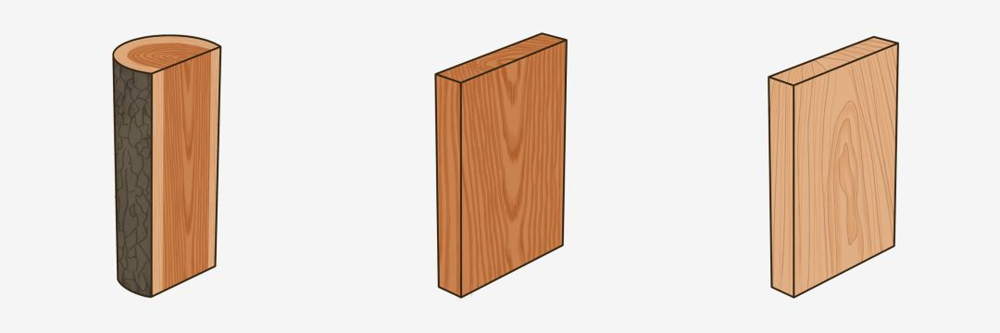  
樟子松纵切面、心材、边材

### 榉木

纹理端正笔直，肌构细腻均匀，光泽较好，剖面常带深色斑纹或条纹。国内市场上，也常将鄂西、川东出产的山毛榉称为榉木，选购时需认清产地。进口的榉木多是来自东欧的高山榉，供应量大且稳定，因运输、储藏、品性等原因，最后数倍价格于国产榉木。在中高端木材里，榉木价格相对低廉但毫不逊色。从地板、家具到用具、玩具等，都能看见它的身影。

是美观好用，性价比略高的木材。

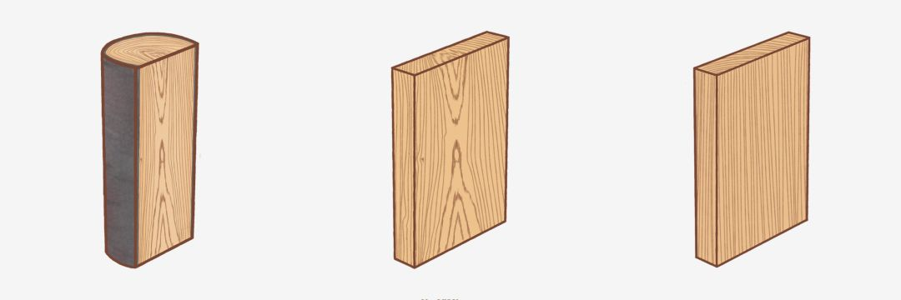  
榉木纵切面、心材、边材

### 白蜡木、水曲柳

欧洲、西亚以及俄罗斯、北美均有所产。质地坚韧有弹性，抗冲击能力中等，触感柔和，质量厚重。木纹呈山型或水型。因心材会由淡棕过渡到深棕，所以有着天然的层次感，纹路较深。国产的水曲柳和白蜡木实属同一树种，但在木材市场中被分开看待，前者与后者的木纹相近但偏黄，木材密度略小，纹路间距也略小。白蜡木通常应用于高档家具，平时需注意保养，应避免长时阳光直照和过度干燥。

是颜值和实力并存，略娇贵的木材。

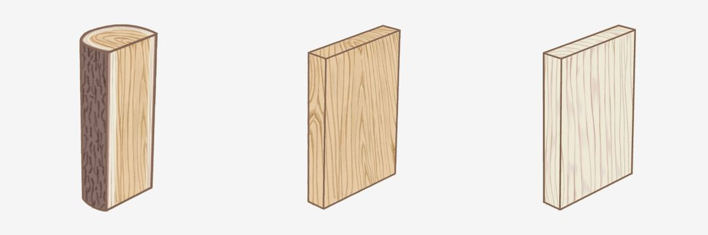  
白蜡木纵切面、心材、边材

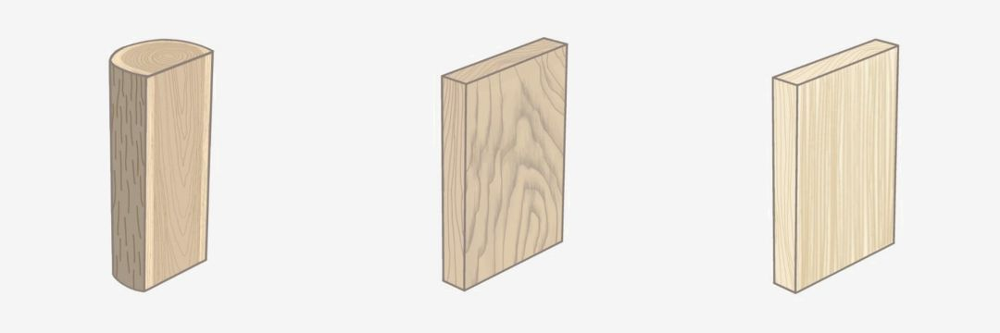  
水曲柳纵切面、心材、边材

### 樱桃木

通常指北美樱桃木，木纹较白蜡木更细腻淡雅。色泽较浅略带偏红，随着日常使用，颜色会渐深，并浮现矿物线。国内市场上，欧洲樱桃木可能会指原产俄罗斯境内的白桦木。国产樱桃木，可能指产于吉林长白山区的东北桦木，或产于云贵川的西南桦木，选购时需留意。

是高颜值，略贵于白蜡木的木材。

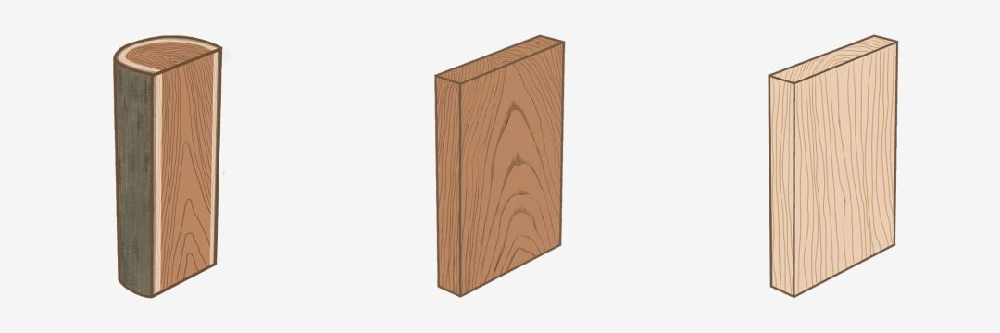  
樱桃木纵切面、心材、边材

### 橡木

主要指红橡木，白橡木较稀有，是各酒庄酿酒所使用的酒桶的材质。质地细密，强度高，不易吸水，耐腐蚀，寿命长，对工艺的要求相对苛刻。适合用于制作各类高档家具。在作为铺地或柜面用材时，表面柔和且清晰的山型纹理十分耐看。作地板时，木料坚实且触感良好，可适当缓和落脚时的重量。名字与“橡胶木”相近，谨防“橡胶木”简称为“橡木”的文字游戏。

是各方面都很优秀，考验工艺水平的木材。

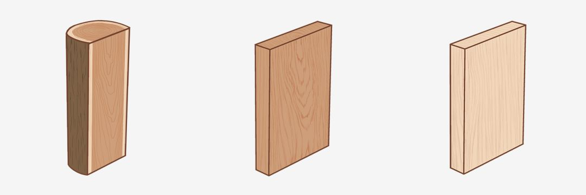  
橡木纵切面、心材、边材

### 桦木

供应量大、价格稳定、低廉耐用。质地适中或软，弹性欠缺，延展性略差，过度干燥易开裂。纹理上接近北美樱桃木，呈山型，有曲折，但树心颜色偏浅偏黄，没有棕色斑点和树胶窝，木质密度也低得多。用途广泛，在易腐蚀环境下，可作心材使用。市场上曾存在以桦木冒充北美樱桃木的陷阱，选购时需注意。

是低价耐用、被大量使用的木材。

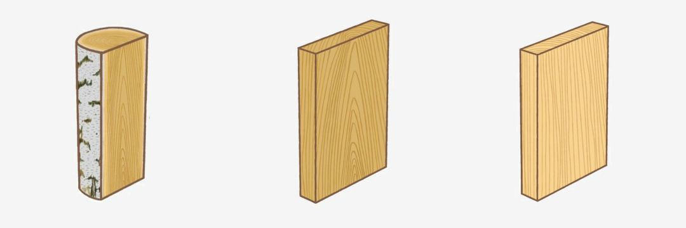  
桦木纵切面、心材、边材

## 原产地一瞥

上述木材，在北半球有两大产区：

泰加林，源于突厥语或蒙语，原指西西伯利亚的间布沼泽的森林，现在泛指寒温带的针叶林。林带范围，从北极苔原南界或树木北界向南，延伸1000多公里。林带内，群落结构极为简单，通常由一到两个树种组成，成片地密集地分布，底层常伴有灌木层、草木层、苔原层。在这里生长的欧洲赤松、桦木等树木高大挺拔，纹理顺直，硬度适中。目前是世界优良木材的重要供应地。

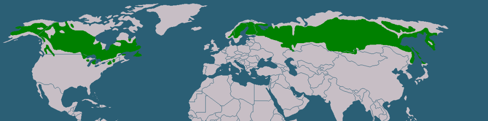  
泰加林，by Vzb83 on wikimedia commons / by-sa 3.0

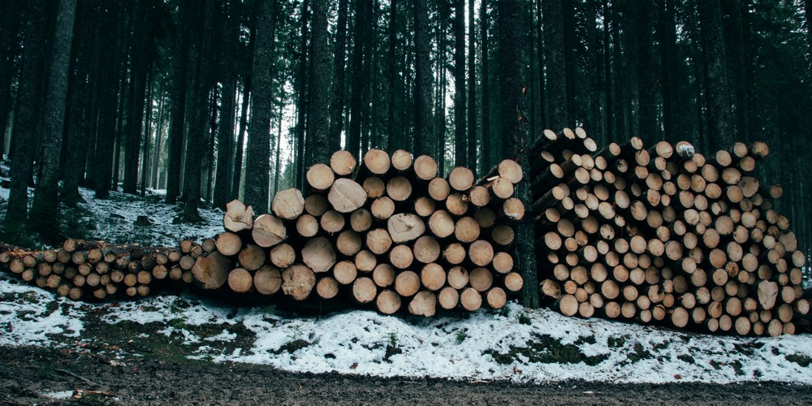

温带阔叶针阔林，包括了阔叶林和针叶阔叶混生林，主要聚集在欧洲西缘、北美东缘和亚洲东缘。林带内群落结构是四层：成熟树木组成的林冠层、未成熟树木组成的下林冠层、灌木层、草本层。相较于热带雨林，林内的生物多样性多富集在更靠近地面的区域。树种丰富，曾一度被过度开发，现在多以保护野生动物、涵养水源、林地修养、旅游开发为优先。

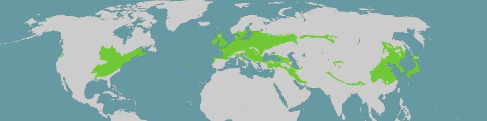  
温带阔叶针阔林, by Terpsichores on wikimedia commons / by-sa 3.0

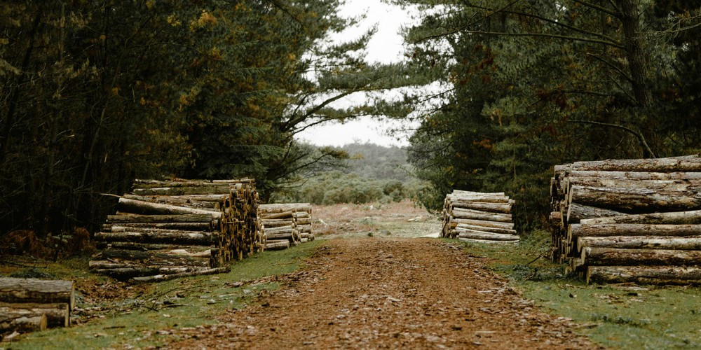

## 木材交易所一瞥

国内木材的价格近年来波动明显，但大致上和国际木材价格的走势一致。是什么影响了消费者所关心的木材的价格呢？这背后有一些大的因素，或许你曾有所耳闻：

2014年3月，克里米亚事件爆发。俄罗斯遭到北约经济制裁和封锁，油价暴跌，卢布贬值。国内资金在这时投资了俄罗斯林业。合资环境下，国内进口俄罗斯木材比重飙升。位于俄罗斯托木斯克州的阿西诺木材工业综合体，长期专门生产桦木制品，并宣称“从木材的质量上讲，俄罗斯桦木几乎不逊于橡木和山毛榉，而生产成本却低廉很多”。俄罗斯木材因此畅销，甚至导致了滥伐。2018年5月，为了减少非法采伐，合理地经营森林资源，以及打算进行产业升级，俄罗斯修订了《联邦森林法》，从2020年起逐步禁止针叶类商用木材出口。

2016年，美国房地产市场经历了次贷危机后的全方面复苏，建材市场一并回暖。

2017年3月，中美贸易战爆发。

2018年8月起，中国对进口的美国木制品和原木加增关税。2019年6月1日起，提高了部分商品加征关税税率。目前，橡木原木加征25%，樱桃木、白蜡木加征20%。

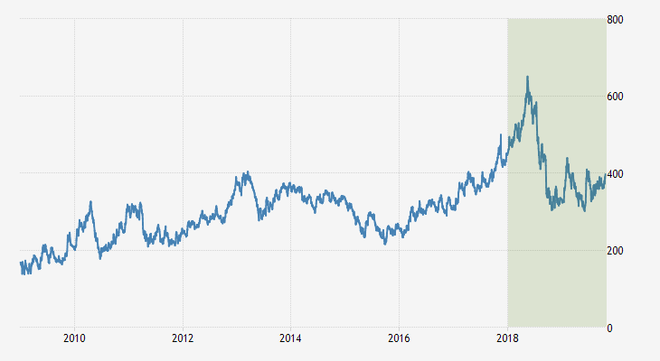

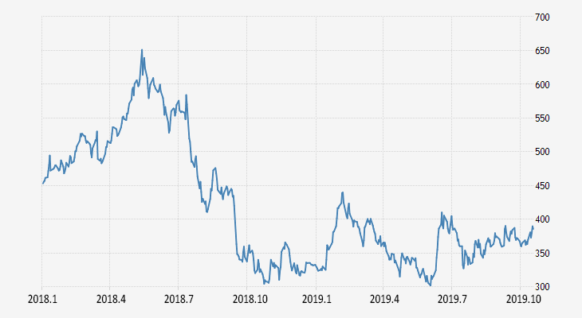  
国际市场期货木材价格，on tradingeconomics.com

数据显示，期货木材的价格，在2016到2018年间，稳步攀升，到达了最高点，之后回落。据预测，直到2020年，木材价格才有可能恢复上涨。