```
Date: 2020.05.31
Author: 中立大手指
Source: https://mp.weixin.qq.com/s/DjSvoneE12USstiGcxZInw
```

# 新中国最后的火魔法师：气仙人严新传奇

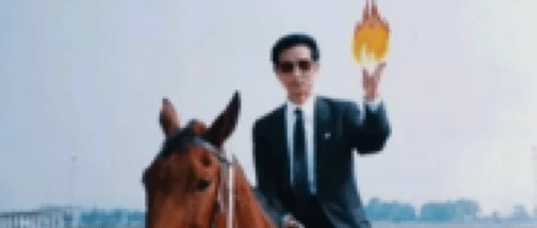  
封面上的火焰是作者为了突出严大师的功力PS得之

## 摘要

上世纪八十年代，我国曾掀起过一阵专注于特异功能的“人体科学”研究热潮，三山五岳中凭空长出了无数各怀绝技的特异功能大师，皆冠以气功之名。当年特异功能大师们无视一切物理法则的神奇表演，远胜如今一众所谓“太极宗师”。本文就为您介绍其中的佼佼者——大法师严新同志。

## 第一章 混子气功

蜀地自古出俊杰，有着李白故里之称的四川省江油市，除了养育出诗仙李白之外，亦诞生了武仙海灯法师、气仙严新，与诗仙李白并称“江油三仙”。其中诗仙李白自不必多言，武仙海灯法师我不想管，今天主要介绍江油三仙中的气仙：严新先生。

严新，四川江油东安乡福严村人。据本地人所言，严新少时颇为风流，终日行走街头巷尾，属于当地混子圈中小有名气的人物。怎奈在体制严密的计划经济时代当混混算不得工作岗位，中学毕业的严新只好进入四川省绵阳市卫生学校学习卫生，并于七十年代末回到东安乡担任赤脚大夫。

随着人民群众对气功治疗趋之若鹜，尤其是1979年中央领导人接见气功汇报团后，气功热逐渐席卷祖国大地，据称顶峰时全国共有气功弟子一亿人。和当时所有的特异功能大师一样，严新也在这一时期没有任何征兆地就拥有了能救死扶伤的神奇气功，声称可发动真气治疗病患。天选之人的幸运吾等鼠辈肯定无法企及，二十岁出头就阳痿虽然很也少见，但真算不上特异功能，所以您就不必执念于用这个本事和严新大师比个高低了。

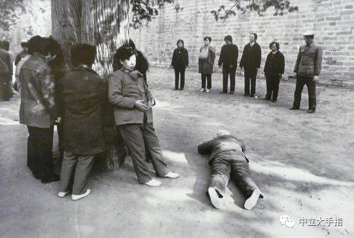  
气功好像的确能增强摄影师的构图能力

八十年代初期，正值文革结束改革开放大幕拉开。当革命运动的理想主义转变为为国内外物质现实的巨大落差，国人在自卑与自傲的混合心态中开始了对西方世界“弯道超车”的追求。在工农商业全面落后的情况下，特异功能成为了民族自尊心和自豪感的唯一寄托和希望，而特异功能工作者（以下简称“特工”）则成为保证我国屹立于世界民族之林的特殊战略资源，是万众瞩目的明星。

眼见严新终日不顾病人只顾发功，小小的乡卫生院自知已容不下此尊大神，但如何为特异功能者安排工作岗位也是难题。思来想去，也就是同样被划分为“人体科学”的中医和特异功能一样说不出个所以然，遂将严新推荐至重庆中医研究所。

1982年，严新调入重庆中医研究院门诊部正式从医，开始以特工身份的展开活动，据传治好病患数千，不孕不育，早泄不举，小儿麻痹，癌症晚期，反正逮着什么治什么，古今中外的病魔纷纷在严新特工的气场中败下阵来。

时至今日，人民群众依然对此类我朋友听说、我二大爷亲眼看到，我三姑电话通知的鬼魅消息深信不疑，很快就有本地《四川工人日报》记者登门采访，发表《神医·神话·现实》一文。也不知这位记者是不是被严特工利用什么手段操纵了大脑，文中有名有姓的报道严新用盖世神功治好半身不遂患者一例、全身瘫痪患者一例、瞎子一例、聋子两位，癌症患者若干；声称其治疗癌症像“治疗伤风感冒”般轻松，所作所为直逼当年秉着圣灵显现神迹的耶稣基督。

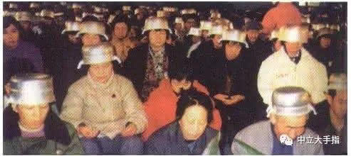  
特工操纵人民群众的大脑有很多手段，比如著名的“信息锅”

> “就是瞎子看见，瘸子行走，长大麻疯的洁净，聋子听见，死人复活，穷人有福音传给他们。”  
> ——马太福音11：5

1985年以来，《体育爱好者》、《气功与科学》等杂志陆续报导了严新，其大名开始广为流传，正如耶稣散布的福音。可就像心胸狭窄的法利赛人诋毁耶稣一样，重庆中医院那些不义之徒也容不下严新，说什么此人看病只画符不开药差点治死人，被家属当街打出好几条街；害得严新从医两年后就被以搞封建迷信为名取消了处方权。一代气仙从此浪迹天涯，沦为江湖郎中。

像严新这么拉风的特工，就像黑夜里的萤火虫，到哪都是那样的鲜明，那样的出众。谁也没想到，摆脱了体制束缚的严新竟然活出了属于自己的无限精彩。

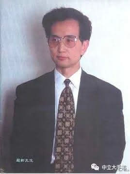  
气仙严新尊容

请各位平复下激动的心情，认识一下这位风度翩翩的特工，来自三仙之城四川省江油市的严新大师。严新同志，你这沉默如迷的双眼啊，仿佛随时准备发射出神秘莫测的反科学激光。

反科学激光？不，我的意思是科学的激光。我们马克思主义者不玩基督教圣灵附体的那一套，特异功能必须在伟大的无产阶级专政下得到科学解释。自从钱学森同志做出了继“亩产万斤是科学”之后第二英明的论断“气功是科学”后，一切特异功能皆以科学之名，反特异功能就是反对科学，反气功就是反对中华民族的伟大历史复兴。

只是当时的一线特工，如张宝胜之流主要擅长表演耳朵识字、隔空取物或者炸豌豆发芽等奇技淫巧，总之尚属于点错技能树的杂耍演员；唯有严大师高调宣传自己气功治病救人的本事，很快引起了国防科工委主任张震寰将军的注意。听说祖国西南有位能令瞎子看见瘸子行走的气体耶稣，张将军遂将其招至京城，治疗饱受癌症侵袭的两弹元勋邓稼先同志。

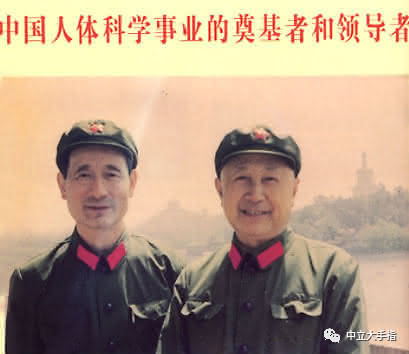  
中国人体科学界的先知，张震寰（左）与钱学森（右）同志

严新到来时，邓老虽然已经是癌症晚期高烧不退，头脑却不糊涂，坚持不让严新为其治疗。被主治医生从病房里赶跑后，严新屈居国防科工委招待所，一身神功无处施展，救死扶伤之心却是饥渴难耐。气满自溢之下，忽然又升级出了隔空发功这一旷世绝学。

六月下旬起，严新每日从国防科工委招待所发功给邓稼先同志止痛退烧，并且“收到良好疗效”。大师每日发功，大师乐在其中，直到邓稼先去世的7月29日，没得到消息的大师仍在招待所阳台上一拱一拱的为已经去世的邓老发功治疗。

八十年代时特异功能乃治国之本，气功容不得半点诋毁，反正治好了肯定是气功的功劳，没治好自然是医生护士们添乱。总之高层已有定论，气功是科学，气功治百病，此乃真理颠扑不破。北上治疗邓稼先虽然没让严新捞到什么资本，但有了气功这旱涝保收的本事，迈进了大北京的城门就是人生的转机。

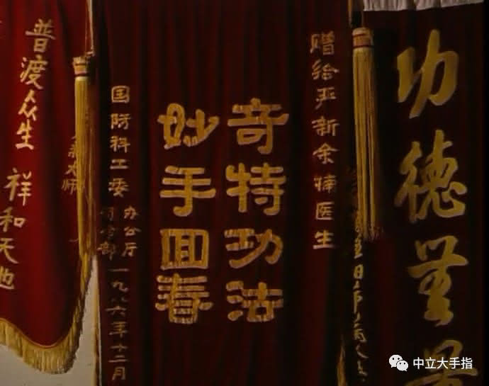  
消灭了优秀的真科学家邓稼先后，严新喜获国防科工委颁发的锦旗

## 第二章 分子气功

八十年代的气功热潮中，各类“人体科学”研究机构如雨后春笋般冒出，特工是各大机构争抢的战略资源。作为我国最高等的科研学府，清华大学自然不甘落后，于1985年由副校长滕藤教授亲自批准将气功作为清华大学基础科研项目，后成立“气功科研小组”广撒求贤帖招募特工人才。

“气功科研小组”筹备时，正是严新发功治死邓稼先后无所事事那段时间。得知被国防科工委钦点的抢救两弹元勋的大特工正在北京，清华大学气功科研小组遂向严新抛出了橄榄枝。

在清华大学气功科研小组内，严新既负责研究又负责被人研究，与李升平（著名的学术混子）、陆祖荫（早年研究电子对撞机后来脑子有点毛病）等人联合，先后收获了一大批科学透顶的研究成果。首先是1986年发表的《气功外气对合成气体影响的观测》一文，声称气功可以改变分子机构，开启了当代点石成金术的先河。

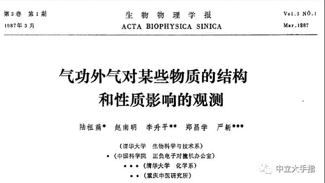  
建国以来生物物理领域的终极发现

时任中国人体特异功能学会理事长的钱学森对此文评论为：“确实无可辩驳地证明了人体可以不接触物质而影响物质，改变其分子结构。这是前所未有的工作。所以应立即发表，及时向全世界宣告中国人的成就!”科学巨擘一开口，哪个虫儿敢作声？钱学森的肯定让严新声名鹊起，一夜之间变成中国特工界的领军人物。

大学里上过《法学基础》课程的人都知道，玩弄元素只是法师的基本功，重要的是如何利用各种元素组合出呼风唤雨的魔法来。毫无疑问，熟练操纵分子的严新是建国以后掌握元素魔法的第一人，自然也成为建国后从特工转职为法师的第一人。下图中，修仙得道的严新大法师背后燃起了三昧真火。

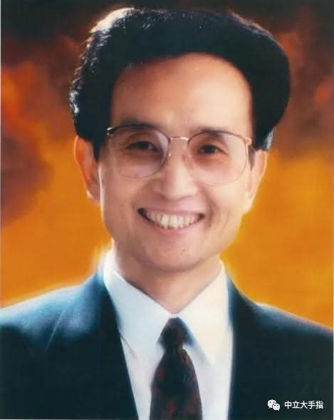  
这么大的头像看上去有点恶心真是对不起

1987年春晚，初代万人迷费翔站上舞台上演唱《冬天里的一把火》，未想一语成谶，当年五月一场大火烧掉了半个大兴安岭。面对这场建国以来最大的火灾，沈阳军区司令部的领导们如芒在背，不知怎么就有人将大法师严新可以操纵火元素的消息传到领导耳中。于是沈阳军区司令部连发两道金牌，急招严新进帐共同商讨灭火大计。

> “严新同志；你对气功灭火很有研究，能否在这方面介绍一些经验并给予支援。”  
> ——沈阳军区司令部办公室，一九八七年五月十六日

军令如山之下，严新虽满口答应却迟迟不发功，只是反复声称时辰未到。待新闻报道火势日趋缓解后，大师终于选好时辰登高做法，用他神奇的分子气功“将火灾地区的氧气分子转化为二氧化碳分子”，并发动“气功降雨”以压制火势。几天后，在军民的联合努力下，大兴安岭大火被彻底扑灭。

历史是总是由精英创造，数十万军民的日夜奋战哪里比得过大法师在千里之外的小楼里拱两下，严新理应一人独揽大兴安岭灭火之功。只是后来中科院院宠何祚庥同志提到“严大师早不灭火晚不灭火，偏等大火快把森林烧光了，他才发功灭火”，一语让严新大法师的魔法听上去衰了许多。更重要的是，这句话掀起了气功粉丝与科学神棍何祚庥之间一段互咬至今的恩怨情仇，不过那就是另一个故事了。

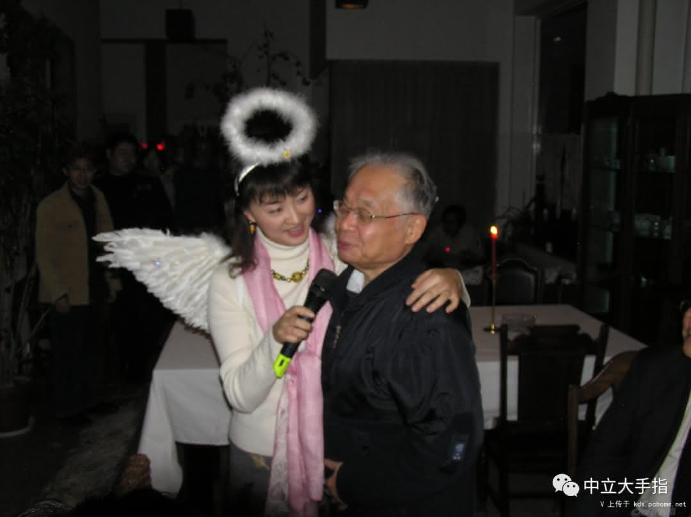  
笑得比较灿烂的那位即为科学棍何祚庥同志。代表言论：三个代表指导量子力学研究

严新同志的灭火功能，打破了以霍格沃兹学院为首的西方法学界对元素魔法的长年垄断，是社会主义改革开放进程中收获的又一项伟大成就。随着媒体报道严新发功灭火这一壮举，举国上下为之欢呼，从创刊起就以通篇扯蛋而冠绝古今的科研杂志《中国气功科学》盛赞其为“国之功臣，世之良师”。此后更传出国师严新出征日本，与日本高人对怼气功波并大获全胜的消息，“一干手下败将纷纷恩求拜严新为师”，那种自卑多年后终于从屁眼里抠出截屎硬过洋人，重拾民族自尊心和自豪感的喜悦，于记者行文间跃然纸上。

能力越大，责任越大，严新即将通过实力证明自己的国师之位绝不是浪得虚名。当琢磨分子不能满足对特异功能孜孜不倦的追求后，我们的大法师再度向物质的更深层次迈进。

## 第三章 原子气功

星球大战里的尤达大师告诉天行者卢克原力分为正反两面，但他忘了说主义也有善恶之分。上世纪六十年代起中苏交恶，以苏修为代表的邪恶主义在我国北方边界陈兵百万，上万辆的坦克的炮筒子齐刷刷指着善良主义的小基地北京。更别说额外的几千枚核弹更是我方心腹大患，该死的苏修叫嚣核平中国早就不是一次两次。怎奈当时正义势弱，只能任邪恶帝国张牙武爪，我方领导人心慌意乱，夜不能寐。

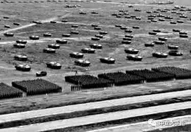  
中苏关系到1989年才算是真正有转机

面对苏修的武力威胁，挽救中华于水火的国师再度出手。我们的大法师百尺竿头更进一步，将分子气功升级为原子气功，糅合其远程发功的绝学，终于在1987年领会到最終の真氣奧義·發功拆解原子彈，声称自己可以远程破坏苏联人的核武器，永解共和国后顾之忧。

为了证明气功破坏原子弹的科学性，严新与李升平、陆祖荫组成的神棍铁三角再度祭出雄文《气功外气对于241Am放射性衰变计数率的影响》，得出远程发功可随意操纵核物质的科研成果。

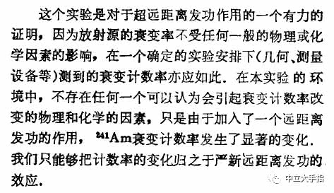  
严新大师开天辟地的原子魔法

原子气功学的创立，代表着我国在神棍领域的研究已经达到了世界领先水平。此等神技一出，意味着严大师在千里之外就能将苏联原子弹化为废铁，对抗苏修数十载，终于抢得一次先机！此后还有哪个国家敢造次，就发动国师削他狗日的，帝国主义在东方架起几门大炮就可以征服一个国家、一个民族的历史一去不复返了！有此等高人坐镇，何愁北方边界不稳，有关部门遂邀请严国师作为定心丸长戍京城。

蜀地自古烟瘴缭绕，不利于气功师采集天地之灵，此时的严新已是大江南北红极一时的人物，自然乐意北上接见更多信徒。1987年后，严新以北京为据点，一边卖着万人气功大会的门票，一边帮着京师防御苏修的核弹头。严新终于爬上了祖国人体科学的最高峰，当时普通人一月工资就几十块钱，而大师的气功报告会门票却是百元难求。要不要去知乎问问八十年代日赚百万是怎样的体验？傻眼了吧，叫你们不练气功！叫你们不练气功！

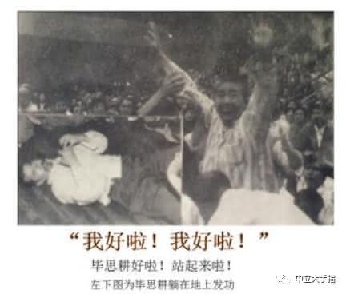  
叫你们不练气功！

## 第四章 量子气功（未遂）

正如钱学森的论证：“气功功夫深的人，能透视人体，透视地下构筑，发气拒敌”。作为一颗祖国特异功能领域的稀世瑰宝，一门可以抵御苏修原子弹于千里之外的镇国气功炮，严新同志无愧于《中国气功科学》为其加冕的国师之荣誉。功之大者，为国为民——我们威风凛凛的国师时刻准备着，时刻准备着，时刻准备着向邪恶力量扔出汇聚信徒真气的元气弹。

可谁也没有想到的是，这样一位为祖国和平发展做出卓越贡献的大师，这样一位理应入选民族复兴名人堂的伟大人物，竟然在九十年代初借一次学术研究之名，卷着信徒们的门票钱跑去美国了！

一种合理的猜测是，九十年代初气功打假之风兴起，何祚庥、司马南等鼠目小人自己练不出特异功能，便终日与气功大师们对喷。所幸我们的气功大师都是胸襟博大之人，每每被打假斗士们当众拆台也能面不改色，更不愿做出发功暗杀等苟且之事来。树大招风，司马南等人打假的第一目标就是气仙严新，国师不愿与小人纠缠，不厌其烦之下就选择去了美国。反正我有千里发功的本事，在哪都能为祖国的繁荣发展做出贡献。

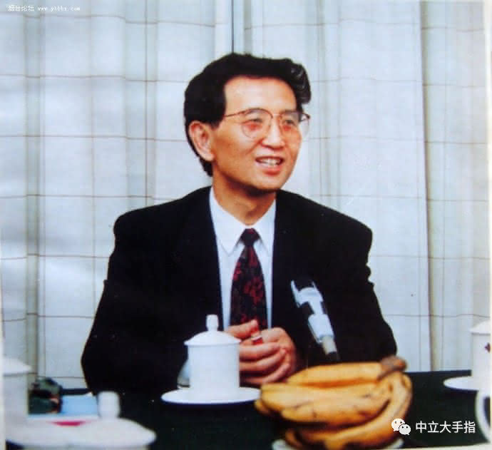  
严新大师因未能发功保鲜香蕉而略显尴尬

如此有德有才的贤人竟然被是被司马南之流赶走，可见国民素质的提升任重道远。不过司马南现在也被赶去了美国，真乃报应也！只是生南为橘生北则为枳，资本主义的腐化导致严大师功力顿减，去了美国后严新忽然就丢失了各种生吞活剥的特异功能，原子功升级量子功的努力也以失败告终，害得大师最终没修出量子通讯的本事，向国内的信徒布置任务还得打越洋电话，除了参加伯乐张震寰的追悼会之外再难回国。

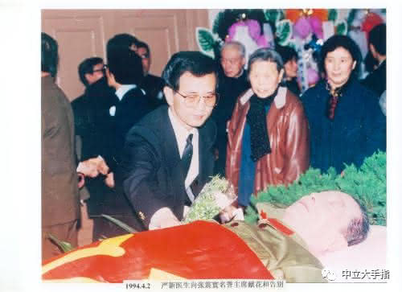  
严新大师因未能发功治好恩公而略显沮丧

1995年前后，严新还在陆续向国内信徒千里发功，日后渐渐就没了消息。每每有信徒邀请大师回国讲学，严新都已“事务繁忙”之名推脱。也不知严大师在国外究竟是如何日理万机，总之就是宁愿赖在国外跳大神也死活不愿回国，自家老母病逝时亦不肯回国尽孝（为何不发功救母也是谜团），但仍嘱咐丧事操办者“切记在灵堂内接电表，不可白用电占国家便宜”，拳拳报国赤子之心，令吾等旁观者闻之，亦不禁潸然泪下也。

## 参考文献

1. 张震寰，《宇宙是个谜，人也是个谜》，中国气功科学，1995  
2. 严新，陆祖荫，张天保，王海东，朱润生，《气功外气对于241Am放射性衰变计数率的影响》，自然杂志，1988  
3. 严新，李升平，孟桂荣，孙孟寅，崔元浩，晏思贤，《气功外气2000公里超距对物质分子作用影响的实验研究》，自然杂志，1988  
4. 严新，郑昌学，周广业，陆祖荫，《气功外气对核酸溶液紫外吸收影响的观测》，自然杂志，1988  
5. 严新，赵南明，尹长城，陆祖荫，《气功外气对于脂质体相行为的影响》，自然杂志，1988  
6. 严新，赵南明，郑昌学，陆祖荫，李升平，《气功外气对某些物质的结构和性质影响的观测》，生物物理学报，1987  
7. 钱学森，《建立唯象气功学——当前气功科学研究的一项任务》，自然杂志，1986  
8. 钱学森，《系统科学、思维科学与人体科学》，自然杂志，1981