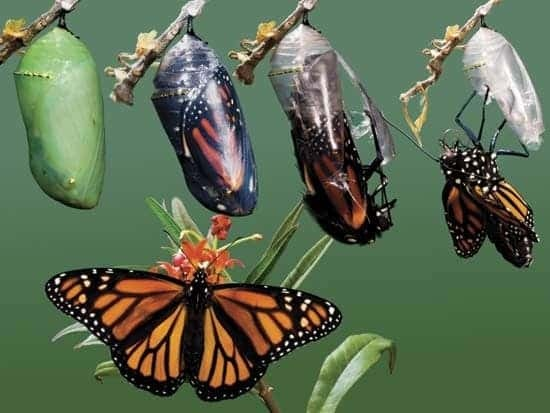
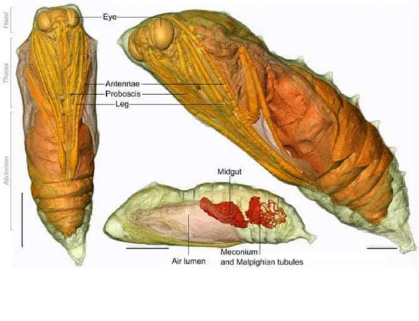

```
Date: 2023.11.16
Translator: BALI
Source: https://jandan.net/p/114788
OrigTranslator: zmescience
OrigSource: https://www.zmescience.com/feature-post/natural-sciences/animals/invertebrates/how-caterpillar-turn-butterfly-0534534
```

# 毛毛虫是如何变成美丽蝴蝶的

从毛毛虫这样卑微的开始，这些昆虫经历了一次惊人的变态，将它们变成了大自然中最优雅的生物之一。

毛毛虫从树上爬行的12条腿的害虫，变成了雄伟的飞蝶，这是一个经常被用作戏剧性转变隐喻的例子。这实在是大自然发展出的一个奇妙的机制。然而，虽然从外表上看可能很奇妙，但在毛毛虫的蛹内部，这个变态过程看起来相当恐怖。



为了让毛毛虫变成蝴蝶，它会通过被激发的酶来消化自己。然后，睡眠细胞（类似于干细胞）会长出未来蝴蝶的身体部位。所以你以为青春期很痛苦？等你了解了毛毛虫变成蝴蝶的变态过程后，再看看吧。

## 一个艰难的变态过程

我们的故事始于一只母蝴蝶产下的卵。这些卵通常很小，圆形，可以在植物的叶子上找到。卵孵化后，就会出现小毛毛虫。很快，小毛毛虫（在科学上被称为幼虫）就会吃掉树叶，一点点地长大。它们会狼吞虎咽地吃树叶，可以长到比原来大一百倍。

当它们长得比自己的皮肤大时，一种叫做蜕皮激素的激素就会被释放出来，指示幼虫进行蜕皮。在蜕皮大约五次后，幼虫就不再进食，从树枝或叶子上倒挂下来，然后要么纺织丝质的茧，要么蜕皮成闪闪发光的蛹。这个阶段被称为蛹化。这个过程由同一种激素驱动，叫做蜕皮激素，但这一次它与另一种叫做幼虫激素的激素一起发挥作用。幼虫激素的作用是延迟整个幼虫阶段的变态。它通过阻止想象盘中的某些基因来发挥作用——想象盘是一个微小的盘状细胞团，在毛毛虫包裹在蛹内部时启动。当毛毛虫准备进行变态时，这些想象盘最终会变成触角、眼睛、翅膀或其他蝴蝶的部件。因此，幼虫激素对于毛毛虫在变态之前的生存至关重要。你看，一旦幼虫达到最后一次蜕皮，开始变态，它的身体就会发生奇怪的变化。幼虫的肌肉、肠道和唾液腺中的细胞被消化，成为即将出现的蝴蝶的备用部件。每个细胞都被编程自我消灭，通过激活一种叫做半胱氨酸蛋白酶的酶。

半胱氨酸蛋白酶会撕裂细胞中的蛋白质，释放出优质的制造蝴蝶的材料。如果没有幼虫激素，这可能随时发生，杀死毛毛虫。相反，大自然将这种激素编程为在最适合变态的时刻降低其水平。幼虫激素减少后，蜕皮激素会驱使毛毛虫蛹化。一旦毛毛虫分解掉除了想象盘以外的所有组织，这些想象盘就会利用周围富含蛋白质的汤液来推动快速细胞分裂，形成成年蝴蝶或蛾的翅膀、触角、腿、眼睛、生殖器和所有其他特征。例如，果蝇的翅膀想象盘可能一开始只有50个细胞，到变态结束时可能增加到超过5万个细胞。



变态过程可能需要几个星期到几个月不等，这取决于蝴蝶的物种。在这段时间里，蝴蝶容易受到捕食者和环境因素的影响，这可能会阻碍它的发育。但对于那些成功度过的蝴蝶来说，最终的结果是一种无与伦比的美丽和优雅的生物。

变态不仅仅是一种美丽的身体变化，它也是进化机制的惊人展示。蝴蝶和毛毛虫不仅外表不同，行为也不同。一个在树上爬行，另一个则在树周围飞翔。最重要的是，一个吃树叶，另一个则只吃花蜜。由于它们不会干扰彼此的食物储备，所以在生态系统中有足够的空间供两种生物共存。这实在是太巧妙了！

不幸的是，很少有影像记录了变态的过程。上面这张令人难以置信的照片是由迈克尔·库克拍摄的，他成功地拍摄到这只苏绢蛾（Antheraea penyi）在一次失败的尝试中纺织茧时的情景。你可以看到一个尚未成熟为成年蛾子的蛹的精致、半透明的翡翠色翅膀、触角和腿——这是通常隐藏在茧内的东西。

幸运的是，我们生活在21世纪。借助现代成像技术，比如CT扫描，我们可以在不干扰这个极其微妙的过程的情况下窥视茧内部。下面的视频是由伦敦自然历史博物馆的科学家拍摄的。

毛毛虫变成蝴蝶是大自然的奇迹，它永远不会停止让人惊叹。它提醒我们这些昆虫的令人令人惊叹的变态过程不仅仅是一种美妙的自然现象，它也提醒我们生命中的变化和进化是必不可少的。无论是在自然界还是在我们自己的生活中，变化都是不可避免的，但它们也可以带来美妙的发展和进步。让我们学习借鉴毛毛虫变成蝴蝶的过程，勇敢地迎接变化，让自己变得更加美丽和优雅。